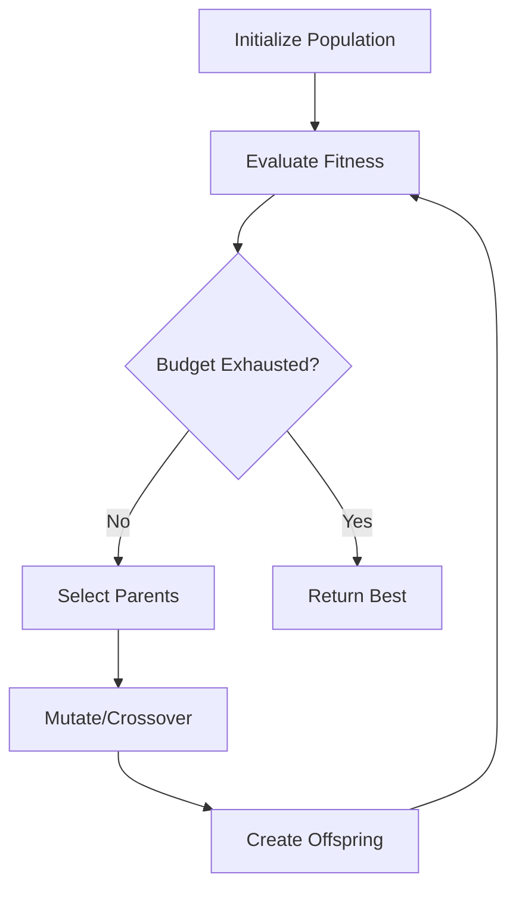
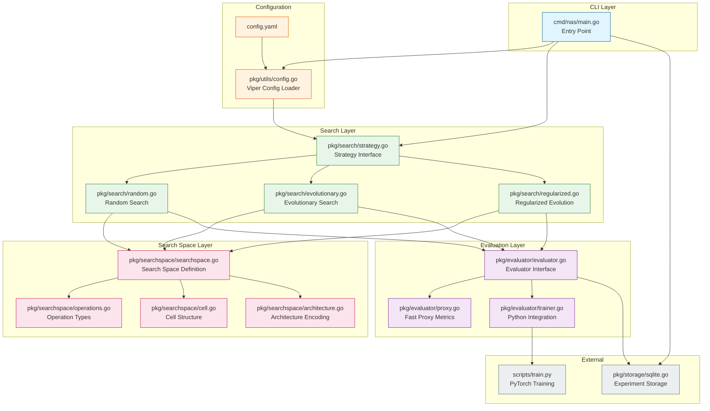
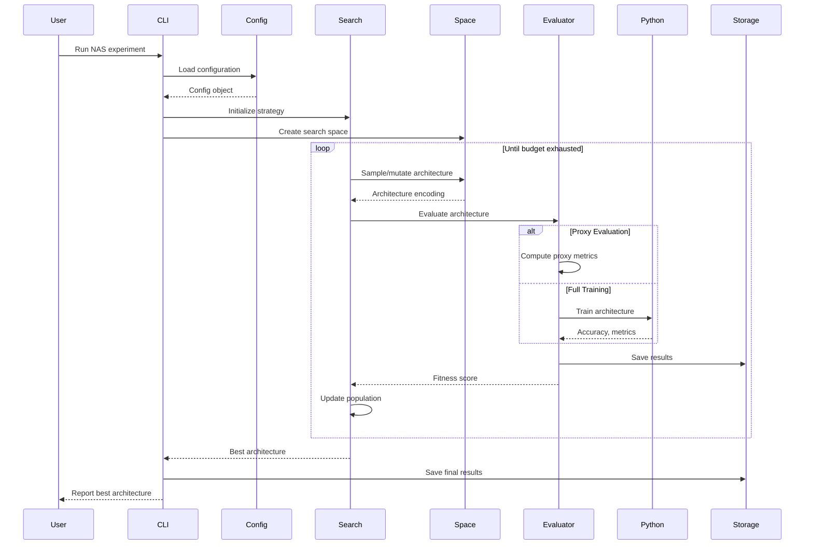
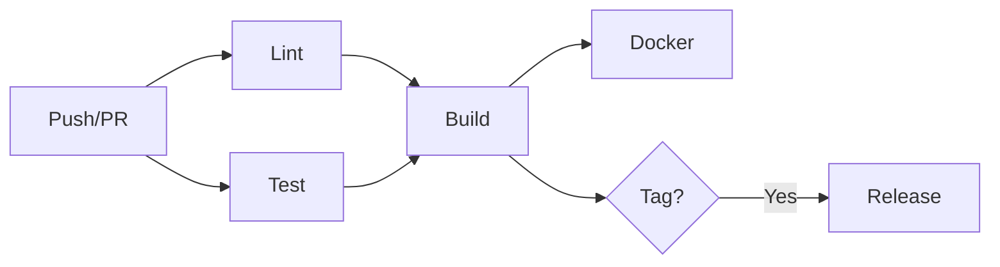

# Neural Architecture Search (NAS) in Go - Implementation Plan

> **Session Status**: Session 1 of 7 - Foundation  
> **Last Updated**: 2026-01-26

---

## Table of Contents
- [Session 1: Foundation](#session-1-foundation)
  - [1.1 Learning Roadmap](#11-learning-roadmap)
  - [1.2 Architecture Overview](#12-architecture-overview)
  - [1.3 Project Folder Structure](#13-project-folder-structure)

---

# Session 1: Foundation

This session establishes the foundational knowledge and architectural design for our NAS system.

## 1.1 Learning Roadmap

### 1.1.1 Go Fundamentals

Before diving into NAS implementation, ensure you understand these Go concepts:

#### Goroutines & Channels
Goroutines are lightweight threads managed by the Go runtime. Channels are typed conduits for communication between goroutines.

```go
// Example: Basic goroutine and channel usage
// Goroutines are spawned with the 'go' keyword - much lighter than OS threads
// Channels provide synchronized communication between goroutines
func main() {
    // Create a buffered channel that can hold 10 integers
    // Buffered channels prevent blocking until the buffer is full
    jobs := make(chan int, 10)
    
    // Launch a goroutine - this runs concurrently with main()
    go func() {
        for job := range jobs {
            fmt.Printf("Processing job %d\n", job)
        }
    }()
    
    // Send jobs to the channel
    for i := 0; i < 5; i++ {
        jobs <- i
    }
    close(jobs) // Always close channels when done sending
}
```

**Resources:**
- [Go by Example: Goroutines](https://gobyexample.com/goroutines)
- [Go by Example: Channels](https://gobyexample.com/channels)
- [Effective Go: Concurrency](https://go.dev/doc/effective_go#concurrency)

#### Interfaces
Interfaces define behavior without specifying implementation - key for our pluggable search strategies.

```go
// Example: Interface definition and implementation
// Interfaces in Go are implicitly satisfied - no "implements" keyword needed
// This is different from Java/C# where you must explicitly declare implementation

// Searcher defines what any search strategy must be able to do
type Searcher interface {
    // Search finds the best architecture in the given search space
    // Parameters:
    //   - space: the search space to explore
    //   - budget: maximum number of evaluations allowed
    // Returns:
    //   - best: the best architecture found
    //   - err: any error encountered during search
    Search(space SearchSpace, budget int) (best Architecture, err error)
}

// RandomSearch implements Searcher using random sampling
// Go knows this implements Searcher because it has the Search method
type RandomSearch struct {
    rng *rand.Rand // Random number generator for reproducibility
}

// Search implements the Searcher interface for RandomSearch
func (r *RandomSearch) Search(space SearchSpace, budget int) (Architecture, error) {
    // Implementation here
    return Architecture{}, nil
}
```

**Resources:**
- [Go by Example: Interfaces](https://gobyexample.com/interfaces)
- [Effective Go: Interfaces](https://go.dev/doc/effective_go#interfaces)

#### Generics (Go 1.18+, updated in 1.25)
Generics allow type-safe code reuse without sacrificing performance.

```go
// Example: Generic worker pool for NAS evaluation
// Generics (introduced in Go 1.18) let us write type-safe reusable code
// The [T any] syntax declares a type parameter T that can be any type

// Pool represents a generic worker pool
// T is the type of work items, R is the type of results
type Pool[T, R any] struct {
    workers   int              // Number of concurrent workers
    workFunc  func(T) R        // Function to process each work item
    inputChan chan T            // Channel for incoming work
    resultChan chan R           // Channel for results
}

// NewPool creates a new worker pool with the specified number of workers
// Why generics here? We can reuse this pool for:
// - Evaluating architectures (T=Architecture, R=float64)
// - Generating mutations (T=Architecture, R=[]Architecture)
// - Any other parallel workload
func NewPool[T, R any](workers int, workFunc func(T) R) *Pool[T, R] {
    return &Pool[T, R]{
        workers:   workers,
        workFunc:  workFunc,
        inputChan: make(chan T, workers*2), // 2x buffer to reduce blocking
        resultChan: make(chan R, workers*2),
    }
}
```

**Resources:**
- [Go 1.18 Release Notes: Generics](https://go.dev/doc/go1.18#generics)
- [Go Generics Tutorial](https://go.dev/doc/tutorial/generics)
- [Go 1.25: Core Types Removal](https://go.dev/blog/go1.25) - simplifies generics

#### Error Handling (2025 Best Practices)
Go uses explicit error checking with the `if err != nil` pattern. Use error wrapping for context.

```go
// Example: Modern Go error handling with wrapping
// Go treats errors as values, not exceptions
// The %w verb (Go 1.13+) wraps errors, preserving the error chain

import (
    "errors"
    "fmt"
)

// Sentinel errors are pre-defined errors for comparison
// Use these for errors that callers need to check specifically
var (
    ErrInvalidArchitecture = errors.New("invalid architecture")
    ErrSearchFailed        = errors.New("search failed")
)

// EvaluateArchitecture evaluates and returns the accuracy of an architecture
// Parameters:
//   - arch: the architecture to evaluate
// Returns:
//   - accuracy: the measured accuracy (0.0 to 1.0)
//   - error: wrapped error with context if evaluation fails
func EvaluateArchitecture(arch Architecture) (float64, error) {
    if !arch.IsValid() {
        // Wrap the sentinel error with context using %w
        // This preserves the original error while adding information
        return 0, fmt.Errorf("architecture %s: %w", arch.ID, ErrInvalidArchitecture)
    }
    
    accuracy, err := runTraining(arch)
    if err != nil {
        // Always add context when crossing package boundaries
        return 0, fmt.Errorf("training architecture %s: %w", arch.ID, err)
    }
    
    return accuracy, nil
}

// Example of checking wrapped errors using errors.Is()
func handleError(err error) {
    // errors.Is checks the entire error chain
    if errors.Is(err, ErrInvalidArchitecture) {
        // Handle invalid architecture case
    }
}
```

**Resources:**
- [Go Blog: Working with Errors in Go 1.13](https://go.dev/blog/go1.13-errors)
- [Effective Go: Errors](https://go.dev/doc/effective_go#errors)

---

### 1.1.2 Neural Network Basics

Understanding neural network fundamentals is essential for NAS.

#### Layers and Operations

| Operation | Description | Parameters | Use Case |
|-----------|-------------|------------|----------|
| **Conv 3×3** | 3×3 convolution | kernel_size=3 | Local feature extraction |
| **Conv 5×5** | 5×5 convolution | kernel_size=5 | Larger receptive field |
| **Sep Conv 3×3** | Depthwise separable conv | kernel_size=3 | Efficient mobile networks |
| **Sep Conv 5×5** | Depthwise separable conv | kernel_size=5 | Efficient larger receptive field |
| **Max Pool 3×3** | 3×3 max pooling | stride=1, pad=1 | Subsampling, translation invariance |
| **Avg Pool 3×3** | 3×3 average pooling | stride=1, pad=1 | Smooth subsampling |
| **Skip Connect** | Identity/shortcut | - | Residual connections |
| **Zero** | No connection | - | Sparsity in search space |
| **Dilated Conv** | Atrous convolution | dilation_rate | Larger receptive field, fewer params |

**Resources:**
- [Stanford CS231n: Convolutional Networks](https://cs231n.github.io/convolutional-networks/)
- [Deep Learning Book: Chapter 9](https://www.deeplearningbook.org/contents/convnets.html)

#### Cells and Blocks (NASNet-style)

```
┌────────────────────────────────────────────────┐
│                 CELL (Repeated Unit)            │
│  ┌────────┐   ┌────────┐   ┌────────┐          │
│  │ Node 0 │──▶│ Node 1 │──▶│ Node 2 │──▶ Out   │
│  │(input) │   │  op1   │   │  op2   │          │
│  └────────┘   └────────┘   └────────┘          │
│       │           ▲           ▲                │
│       └───────────┴───────────┘                │
│           (skip connections)                    │
└────────────────────────────────────────────────┘
```

- **Normal Cell**: Preserves spatial dimensions
- **Reduction Cell**: Reduces spatial dimensions by 2×

---

### 1.1.3 Search Algorithms

#### Evolutionary Algorithms



**Key Concepts:**
- **Population**: Collection of candidate architectures
- **Fitness**: Performance metric (accuracy, latency, etc.)
- **Selection**: Choose parents based on fitness
- **Mutation**: Random modifications to architectures
- **Crossover**: Combine parts of two parent architectures

#### Regularized Evolution (from Google Research)

The key innovation is the **aging mechanism**:

```go
// Pseudocode for Regularized Evolution
// Reference: Real et al., "Regularized Evolution for Image Classifier Architecture Search"
// https://arxiv.org/abs/1802.01548

// RegularizedEvolution implements NAS with aging population
// Why "regularized"? The aging mechanism acts as a regularizer,
// preventing the population from getting stuck on early winners
type RegularizedEvolution struct {
    population     []Individual  // Fixed-size population
    populationSize int           // Typically 100
    sampleSize     int           // Tournament size, typically 25
    historyLength  int           // Max age before removal
}

// Step performs one generation of regularized evolution
// 1. Sample random subset from population
// 2. Select best from sample (tournament selection)
// 3. Mutate winner to create child
// 4. Add child, remove oldest individual
func (r *RegularizedEvolution) Step() {
    // Tournament selection from random sample
    sample := r.randomSample(r.sampleSize)
    parent := r.selectBest(sample)
    
    // Create mutated child
    child := r.mutate(parent)
    child.fitness = r.evaluate(child)
    
    // AGING: Remove oldest, not worst!
    // This is the key insight - prevents early lucky architectures
    // from dominating the population forever
    r.removeOldest()
    r.population = append(r.population, child)
}
```

**Resources:**
- [Regularized Evolution Paper](https://arxiv.org/abs/1802.01548)
- [Google AI Blog: AutoML-Zero](https://ai.googleblog.com/2020/07/automl-zero-evolving-code-that-learns.html)

---

### 1.1.4 NAS Concepts

#### Search Space

The search space defines all possible architectures. Our implementation uses a **cell-based search space**:

```go
// SearchSpace defines the set of all possible architectures
// A well-designed search space is crucial for NAS success
// Too small = may miss good architectures
// Too large = search becomes intractable
type SearchSpace struct {
    // Operations available at each edge
    // Example: [Conv3x3, Conv5x5, MaxPool, AvgPool, SkipConnect, Zero]
    Operations []OperationType
    
    // Number of intermediate nodes per cell
    // More nodes = more complex cells, larger search space
    NumNodes int
    
    // Number of input nodes (typically 2: previous cell outputs)
    NumInputNodes int
    
    // Number of cells in the network
    NumCells int
    
    // Positions of reduction cells (spatial downsampling)
    ReductionCellPositions []int
}
```

**Search Space Size Calculation:**
```
For each node (except inputs):
  - Choose 2 input nodes from all previous nodes
  - Choose 1 operation for each input edge

If we have N nodes and O operations:
  - Node i can connect to any of (i + num_inputs) previous nodes
  - Each connection has O possible operations
  
Total architectures ≈ O^(2*N) × C(N,2)^N (very large!)
```

#### Evaluation Strategies

| Strategy | Accuracy | Speed | Use Case |
|----------|----------|-------|----------|
| **Full Training** | High | Very Slow | Final evaluation |
| **Proxy Tasks** | Medium | Fast | Preliminary screening |
| **Weight Sharing** | Medium-High | Fast | Large-scale NAS |
| **Zero-Cost Proxies** | Low-Medium | Very Fast | Initial filtering |

---

## 1.2 Architecture Overview

### 1.2.1 High-Level System Diagram



### 1.2.2 Data Flow



---

## 1.3 Project Folder Structure

```
nas-go/
├── cmd/                          # Application entry points
│   └── nas/
│       └── main.go              # CLI entry point using Cobra
│
├── pkg/                          # Library packages (importable)
│   ├── searchspace/             # Search space definitions
│   │   ├── operations.go        # Operation types (conv, pool, etc.)
│   │   ├── cell.go              # Cell structure and manipulation
│   │   ├── architecture.go      # Architecture encoding/decoding
│   │   └── searchspace.go       # Search space configuration
│   │
│   ├── search/                  # Search strategies
│   │   ├── strategy.go          # Searcher interface
│   │   ├── random.go            # Random search (baseline)
│   │   ├── evolutionary.go      # Basic evolutionary search
│   │   └── regularized.go       # Regularized evolution
│   │
│   ├── evaluator/               # Architecture evaluation
│   │   ├── evaluator.go         # Evaluator interface
│   │   ├── proxy.go             # Fast proxy metrics
│   │   └── trainer.go           # Python/PyTorch integration
│   │
│   ├── storage/                 # Persistence layer
│   │   └── sqlite.go            # SQLite for experiment tracking
│   │
│   └── utils/                   # Shared utilities
│       ├── config.go            # Configuration loading (Viper)
│       └── logging.go           # Structured logging (slog)
│
├── scripts/                     # External scripts
│   └── train.py                 # PyTorch training script
│
├── configs/                     # Configuration files
│   └── default.yaml             # Default configuration
│
├── internal/                    # Private packages (not importable)
│   └── version/
│       └── version.go           # Build version info
│
├── test/                        # Integration tests
│   └── integration_test.go
│
├── .github/
│   └── workflows/
│       └── ci.yml               # GitHub Actions CI/CD
│
├── Makefile                     # Build automation
├── Dockerfile                   # Container build
├── go.mod                       # Go module definition
├── go.sum                       # Dependency checksums
└── README.md                    # Project documentation
```

### Package Responsibilities

| Package | Responsibility | Key Types |
|---------|----------------|-----------|
| `cmd/nas` | CLI parsing, orchestration | - |
| `pkg/searchspace` | Define what architectures look like | `Operation`, `Cell`, `Architecture`, `SearchSpace` |
| `pkg/search` | How to find good architectures | `Searcher`, `RandomSearch`, `RegularizedEvolution` |
| `pkg/evaluator` | How to measure architecture quality | `Evaluator`, `ProxyEvaluator`, `TrainerEvaluator` |
| `pkg/storage` | Persist and query experiments | `ExperimentStore` |
| `pkg/utils` | Cross-cutting concerns | `Config`, `Logger` |

### Design Principles

1. **Separation of Concerns**: Each package has a single responsibility
2. **Interface-Based Design**: Core components defined by interfaces for testability
3. **Dependency Injection**: Components receive their dependencies, don't create them
4. **Fail-Fast**: Validate inputs early, provide clear error messages
5. **Idiomatic Go**: Follow standard Go conventions and patterns

---

## Session 1 Complete ✓

---

# Session 2: Core Data Structures

This session implements the fundamental data structures for our NAS system. These form the building blocks for architecture representation, manipulation, and search.

> **Web Research Completed:**
> - Go struct design patterns 2025 (composition, interfaces, functional options)
> - Go iota enum patterns (custom types, String() methods)
> - NAS cell encoding (DAG-based, cell-based search spaces)

---

## 2.1 Operations (`pkg/searchspace/operations.go`)

This file defines all the neural network operations available in our search space.

```go
// Package searchspace defines the search space for Neural Architecture Search.
// It contains types for representing operations, cells, and full architectures.
//
// The design follows the NASNet/DARTS convention of cell-based search spaces,
// where we search for a small repeatable "cell" that gets stacked to form
// the full network.
//
// References:
// - NASNet: https://arxiv.org/abs/1707.07012
// - DARTS: https://arxiv.org/abs/1806.09055
// - Regularized Evolution: https://arxiv.org/abs/1802.01548
package searchspace

import (
	"fmt"
	"strings"
)

// OperationType represents the type of operation in a neural network cell.
// Using a custom type (not raw int) provides type safety - the compiler will
// catch if you accidentally pass a regular int where an OperationType is expected.
//
// Go doesn't have enums like Python or Java, so we use iota with a custom type.
// This is the idiomatic Go pattern for creating enum-like constants.
type OperationType int

// Operation type constants using iota.
// iota starts at 0 and auto-increments for each constant in the block.
// We use iota because:
// 1. It's less error-prone than manually assigning numbers
// 2. Adding new operations is easy (just add a new line)
// 3. The values are guaranteed to be unique
//
// IMPORTANT: Never reorder these constants in production code!
// The numeric values are used for serialization/storage. Reordering
// would break existing saved architectures.
const (
	// OpNone represents no operation (used for padding or invalid states)
	// Value: 0 (iota starts at 0)
	OpNone OperationType = iota

	// OpIdentity is a skip connection (identity mapping).
	// Passes input unchanged. Essential for residual learning.
	// Value: 1
	OpIdentity

	// OpConv1x1 applies a 1x1 convolution (pointwise convolution).
	// Used to change channel dimensions without spatial mixing.
	// Parameters: channels_in × channels_out
	// Value: 2
	OpConv1x1

	// OpConv3x3 applies a 3x3 convolution with padding=1 to preserve dimensions.
	// The workhorse of CNNs. 3x3 is the most common kernel size because:
	// - It's the smallest size that can capture left/right, up/down, center
	// - Very efficient on modern GPUs
	// Parameters: channels × 9 × channels
	// Value: 3
	OpConv3x3

	// OpConv5x5 applies a 5x5 convolution with padding=2.
	// Larger receptive field than 3x3, but more parameters (25 vs 9).
	// Value: 4
	OpConv5x5

	// OpConv7x7 applies a 7x7 convolution with padding=3.
	// Even larger receptive field. Often used in first layer of networks.
	// Value: 5
	OpConv7x7

	// OpSepConv3x3 is a depthwise separable 3x3 convolution.
	// Factorizes regular convolution into:
	// 1. Depthwise conv: separate 3x3 filter per channel
	// 2. Pointwise conv: 1x1 conv to mix channels
	// Much fewer parameters than regular conv: ~1/9th for 3x3
	// Key to efficient architectures like MobileNet.
	// Value: 6
	OpSepConv3x3

	// OpSepConv5x5 is a depthwise separable 5x5 convolution.
	// Value: 7
	OpSepConv5x5

	// OpDilConv3x3 is a dilated (atrous) 3x3 convolution with dilation=2.
	// Increases receptive field without adding parameters.
	// Receptive field becomes 5x5 with only 9 weights.
	// Value: 8
	OpDilConv3x3

	// OpDilConv5x5 is a dilated 5x5 convolution with dilation=2.
	// Value: 9
	OpDilConv5x5

	// OpMaxPool3x3 applies 3x3 max pooling with stride=1, padding=1.
	// Preserves spatial dimensions. Provides translation invariance.
	// Value: 10
	OpMaxPool3x3

	// OpAvgPool3x3 applies 3x3 average pooling with stride=1, padding=1.
	// Smoother than max pooling. Often used in reduction cells.
	// Value: 11
	OpAvgPool3x3

	// OpZero represents a "zero" operation - no connection.
	// Output is always zeros. Used to represent sparse connections
	// in the search space (i.e., "no edge here").
	// Value: 12
	OpZero

	// opCount is a sentinel value to count operations.
	// Not exported (lowercase) because it's only for internal use.
	// Value: 13 (number of operations above)
	opCount
)

// operationNames maps operation types to human-readable names.
// Using a fixed-size array instead of map for performance.
// Index corresponds to OperationType value.
var operationNames = [opCount]string{
	OpNone:       "none",
	OpIdentity:   "identity",
	OpConv1x1:    "conv_1x1",
	OpConv3x3:    "conv_3x3",
	OpConv5x5:    "conv_5x5",
	OpConv7x7:    "conv_7x7",
	OpSepConv3x3: "sep_conv_3x3",
	OpSepConv5x5: "sep_conv_5x5",
	OpDilConv3x3: "dil_conv_3x3",
	OpDilConv5x5: "dil_conv_5x5",
	OpMaxPool3x3: "max_pool_3x3",
	OpAvgPool3x3: "avg_pool_3x3",
	OpZero:       "zero",
}

// String returns the human-readable name of the operation.
// Implementing String() makes OperationType satisfy fmt.Stringer,
// so it prints nicely with fmt.Printf("%v", op).
//
// Example:
//
//	op := OpConv3x3
//	fmt.Println(op) // Prints: conv_3x3
func (o OperationType) String() string {
	if o < 0 || o >= opCount {
		return fmt.Sprintf("unknown(%d)", o)
	}
	return operationNames[o]
}

// IsValid returns true if the operation type is a valid, usable operation.
// OpNone is considered invalid as it represents an uninitialized state.
func (o OperationType) IsValid() bool {
	return o > OpNone && o < opCount
}

// IsPooling returns true if this is a pooling operation.
// Useful for architecture analysis and when applying stride.
func (o OperationType) IsPooling() bool {
	return o == OpMaxPool3x3 || o == OpAvgPool3x3
}

// IsConvolution returns true if this is any convolution operation.
func (o OperationType) IsConvolution() bool {
	switch o {
	case OpConv1x1, OpConv3x3, OpConv5x5, OpConv7x7,
		OpSepConv3x3, OpSepConv5x5, OpDilConv3x3, OpDilConv5x5:
		return true
	default:
		return false
	}
}

// ParameterCount returns the relative parameter count for this operation.
// Values are normalized relative to a standard 3x3 conv (value = 9).
// This is used for quick architecture size estimation.
//
// Returns:
//   - The relative parameter count as an integer
//   - 0 for operations with no learnable parameters
func (o OperationType) ParameterCount() int {
	switch o {
	case OpNone, OpZero:
		return 0
	case OpIdentity:
		return 0 // No parameters
	case OpConv1x1:
		return 1 // 1x1 kernel
	case OpConv3x3:
		return 9 // 3x3 kernel
	case OpConv5x5:
		return 25 // 5x5 kernel
	case OpConv7x7:
		return 49 // 7x7 kernel
	case OpSepConv3x3:
		return 12 // 3x3 depthwise + 1x1 pointwise ≈ 9 + 1 × channels
	case OpSepConv5x5:
		return 30 // 5x5 depthwise + 1x1 pointwise
	case OpDilConv3x3, OpDilConv5x5:
		return 9 // Same params as regular conv
	case OpMaxPool3x3, OpAvgPool3x3:
		return 0 // No learnable parameters
	default:
		return 0
	}
}

// ParseOperationType converts a string to an OperationType.
// This is useful when loading architectures from JSON/YAML.
//
// Parameters:
//   - s: the string name of the operation (case-insensitive)
//
// Returns:
//   - The corresponding OperationType
//   - An error if the string doesn't match any known operation
//
// Example:
//
//	op, err := ParseOperationType("conv_3x3")
//	if err != nil {
//	    log.Fatal(err)
//	}
//	// op == OpConv3x3
func ParseOperationType(s string) (OperationType, error) {
	lower := strings.ToLower(strings.TrimSpace(s))
	for i := OperationType(0); i < opCount; i++ {
		if operationNames[i] == lower {
			return i, nil
		}
	}
	return OpNone, fmt.Errorf("unknown operation type: %q", s)
}

// AllOperations returns a slice of all valid operation types.
// Useful for iterating over all possible operations in search algorithms.
//
// Note: This excludes OpNone as it's not a valid operation choice.
func AllOperations() []OperationType {
	ops := make([]OperationType, 0, opCount-2) // Exclude OpNone and OpZero typically
	for i := OpIdentity; i < opCount; i++ {
		ops = append(ops, i)
	}
	return ops
}

// DefaultOperations returns the standard operation set used in NAS benchmarks.
// This matches the DARTS search space operations.
//
// Reference: DARTS paper, Section 3.1
func DefaultOperations() []OperationType {
	return []OperationType{
		OpIdentity,
		OpConv3x3,
		OpConv5x5,
		OpSepConv3x3,
		OpSepConv5x5,
		OpDilConv3x3,
		OpMaxPool3x3,
		OpAvgPool3x3,
		OpZero, // Allows the search to "turn off" connections
	}
}
```

---

## 2.2 Cell Structure (`pkg/searchspace/cell.go`)

This file defines the Cell structure - the repeatable unit in our architecture.

```go
package searchspace

import (
	"crypto/sha256"
	"encoding/hex"
	"encoding/json"
	"fmt"
	"sort"
)

// Edge represents a directed connection between two nodes in a cell.
// Each edge carries both a source node and an operation to apply.
//
// In the NAS context, an edge represents:
// 1. WHERE to get input from (InputNode)
// 2. WHAT to do with that input (Operation)
//
// Example: Edge{InputNode: 0, Operation: OpConv3x3}
// means "take output from node 0, apply 3x3 conv"
type Edge struct {
	// InputNode is the index of the source node.
	// Nodes 0 and 1 are typically the cell inputs (previous cell outputs).
	// Nodes 2+ are intermediate nodes within the cell.
	InputNode int `json:"input_node"`

	// Operation is the operation to apply to the input.
	Operation OperationType `json:"operation"`
}

// String returns a human-readable representation of the edge.
func (e Edge) String() string {
	return fmt.Sprintf("%d->%s", e.InputNode, e.Operation)
}

// Node represents an intermediate node within a cell.
// Each node aggregates inputs from multiple edges.
//
// In most NAS papers, each node receives exactly 2 inputs,
// which are then summed (element-wise addition).
// This allows for skip connections and multi-path topologies.
//
// The output of a node is: node_output = op1(input1) + op2(input2)
type Node struct {
	// Edges are the incoming connections to this node.
	// Typically exactly 2 edges per node (following NASNet convention).
	// Each edge specifies which earlier node to take input from
	// and what operation to apply.
	Edges []Edge `json:"edges"`
}

// String returns a human-readable representation of the node.
func (n Node) String() string {
	parts := make([]string, len(n.Edges))
	for i, e := range n.Edges {
		parts[i] = e.String()
	}
	return fmt.Sprintf("node(%s)", join(parts, " + "))
}

// join is a helper to join strings (avoiding strings import for brevity).
func join(parts []string, sep string) string {
	if len(parts) == 0 {
		return ""
	}
	result := parts[0]
	for _, p := range parts[1:] {
		result += sep + p
	}
	return result
}

// CellType distinguishes between normal and reduction cells.
// This is a key concept from NASNet paper.
type CellType int

const (
	// NormalCell preserves spatial dimensions (height, width).
	// Stride = 1 for all operations.
	NormalCell CellType = iota

	// ReductionCell reduces spatial dimensions by half.
	// Stride = 2 for operations connected to input nodes.
	// This is where "pooling" happens in the network.
	ReductionCell
)

// String returns the human-readable name of the cell type.
func (c CellType) String() string {
	if c == NormalCell {
		return "normal"
	}
	return "reduction"
}

// Cell represents a single cell (micro-architecture) in the network.
// A cell is a directed acyclic graph (DAG) where:
// - Input nodes (0, 1) receive outputs from previous cells
// - Intermediate nodes (2, 3, ...) apply operations and aggregate
// - Output is the concatenation of all intermediate node outputs
//
// The full network is built by stacking multiple cells:
// [Input] -> [Cell] -> [Cell] -> [Reduction Cell] -> [Cell] -> ... -> [Output]
//
// This structure makes the search space tractable because:
// 1. We only search for a small cell, not the full network
// 2. Cells are reusable (stack the same cell multiple times)
// 3. Transfer learning: cells found on CIFAR-10 often work on ImageNet
type Cell struct {
	// Type indicates if this is a normal or reduction cell.
	Type CellType `json:"type"`

	// Nodes are the intermediate nodes in the cell (not including input nodes).
	// Typically 4-7 nodes. More nodes = more complex cell = larger search space.
	// The NASNet paper uses 5 intermediate nodes.
	Nodes []Node `json:"nodes"`

	// NumInputNodes is how many input nodes this cell has (typically 2).
	// Input nodes are indexed 0 to NumInputNodes-1.
	// They receive outputs from the previous two cells.
	NumInputNodes int `json:"num_input_nodes"`
}

// NewCell creates a new cell with the specified configuration.
// This is the constructor function (Go convention: New<TypeName>).
//
// Parameters:
//   - cellType: NormalCell or ReductionCell
//   - numNodes: number of intermediate nodes (not including input nodes)
//   - numInputNodes: number of input nodes (typically 2)
//   - edgesPerNode: number of edges per node (typically 2)
//
// Returns:
//   - A pointer to a new Cell with all nodes initialized with zero operations
//
// Example:
//
//	cell := NewCell(NormalCell, 4, 2, 2)
//	// Creates a normal cell with 4 intermediate nodes, 2 inputs, 2 edges each
func NewCell(cellType CellType, numNodes, numInputNodes, edgesPerNode int) *Cell {
	nodes := make([]Node, numNodes)
	for i := range nodes {
		nodes[i].Edges = make([]Edge, edgesPerNode)
		// Edges are zero-initialized, which means:
		// - InputNode: 0
		// - Operation: OpNone (0)
	}
	return &Cell{
		Type:          cellType,
		Nodes:         nodes,
		NumInputNodes: numInputNodes,
	}
}

// Clone creates a deep copy of the cell.
// Important for evolutionary algorithms where we mutate offspring
// without affecting the parent.
func (c *Cell) Clone() *Cell {
	clone := &Cell{
		Type:          c.Type,
		NumInputNodes: c.NumInputNodes,
		Nodes:         make([]Node, len(c.Nodes)),
	}
	for i, node := range c.Nodes {
		clone.Nodes[i].Edges = make([]Edge, len(node.Edges))
		copy(clone.Nodes[i].Edges, node.Edges)
	}
	return clone
}

// TotalNodes returns the total number of nodes (input + intermediate).
func (c *Cell) TotalNodes() int {
	return c.NumInputNodes + len(c.Nodes)
}

// NodeIndex returns the global index for an intermediate node.
// Intermediate nodes are numbered after input nodes.
//
// Parameters:
//   - intermediateIdx: the index within c.Nodes (0 to len(Nodes)-1)
//
// Returns:
//   - The global node index (used for edge connections)
//
// Example:
//
//	cell := NewCell(NormalCell, 4, 2, 2)
//	idx := cell.NodeIndex(0) // Returns 2 (first intermediate node)
//	idx := cell.NodeIndex(1) // Returns 3 (second intermediate node)
func (c *Cell) NodeIndex(intermediateIdx int) int {
	return c.NumInputNodes + intermediateIdx
}

// ValidInputsForNode returns all valid input node indices for a given node.
// A node can only connect to EARLIER nodes (DAG constraint).
// This prevents cycles and ensures the cell is well-defined.
//
// Parameters:
//   - nodeIdx: the global index of the node (including input nodes)
//
// Returns:
//   - A slice of valid input indices: [0, 1, ..., nodeIdx-1]
func (c *Cell) ValidInputsForNode(nodeIdx int) []int {
	if nodeIdx <= 0 {
		return nil
	}
	inputs := make([]int, nodeIdx)
	for i := 0; i < nodeIdx; i++ {
		inputs[i] = i
	}
	return inputs
}

// Hash returns a deterministic hash of the cell structure.
// Used for deduplication in the search algorithm.
// Two cells with identical structure will have the same hash.
func (c *Cell) Hash() string {
	// Use JSON for deterministic serialization
	// (Note: in production, consider a more efficient binary format)
	data, _ := json.Marshal(c)
	hash := sha256.Sum256(data)
	return hex.EncodeToString(hash[:8]) // First 8 bytes is enough
}

// IsValid checks if the cell structure is valid.
// A cell is valid if:
// 1. All edge input nodes are within valid range
// 2. All edge operations are valid
// 3. No node connects to itself or future nodes
//
// Returns:
//   - true if the cell is valid
//   - false if any validation check fails
func (c *Cell) IsValid() bool {
	for i, node := range c.Nodes {
		globalIdx := c.NodeIndex(i)
		for _, edge := range node.Edges {
			// Check input is a valid earlier node
			if edge.InputNode < 0 || edge.InputNode >= globalIdx {
				return false
			}
			// Check operation is valid (OpZero is valid - means no connection)
			if edge.Operation < OpNone || edge.Operation >= opCount {
				return false
			}
		}
	}
	return true
}

// ParameterEstimate returns a rough estimate of the cell's parameter count.
// Useful for constraining the search to find efficient architectures.
// The actual count depends on the channel configuration at runtime.
func (c *Cell) ParameterEstimate() int {
	total := 0
	for _, node := range c.Nodes {
		for _, edge := range node.Edges {
			total += edge.Operation.ParameterCount()
		}
	}
	return total
}

// TopologicalOrder returns the order in which nodes should be computed.
// For our DAG structure with sequential node indices, this is simply [0, 1, 2, ...].
// More complex DAGs would require actual topological sorting.
func (c *Cell) TopologicalOrder() []int {
	order := make([]int, c.TotalNodes())
	for i := range order {
		order[i] = i
	}
	return order
}

// UsedOperations returns the set of operations used in this cell.
// Useful for analysis and reporting.
func (c *Cell) UsedOperations() []OperationType {
	seen := make(map[OperationType]bool)
	for _, node := range c.Nodes {
		for _, edge := range node.Edges {
			if edge.Operation.IsValid() {
				seen[edge.Operation] = true
			}
		}
	}

	ops := make([]OperationType, 0, len(seen))
	for op := range seen {
		ops = append(ops, op)
	}
	// Sort for deterministic output
	sort.Slice(ops, func(i, j int) bool {
		return ops[i] < ops[j]
	})
	return ops
}
```

---

## 2.3 Architecture Encoding (`pkg/searchspace/architecture.go`)

This file defines the complete architecture and its encoding/decoding.

```go
package searchspace

import (
	"encoding/json"
	"fmt"
	"os"
	"time"

	"github.com/google/uuid"
)

// Architecture represents a complete neural architecture.
// It consists of a normal cell (repeated) and a reduction cell.
// The full network is built by stacking these cells.
//
// Network structure (for ImageNet-style):
// [Stem] -> [Normal×N] -> [Reduction] -> [Normal×N] -> [Reduction] -> [Normal×N] -> [Head]
//
// The stem handles initial dimensionality, cells do the heavy lifting,
// and the head produces final predictions.
type Architecture struct {
	// ID is a unique identifier for this architecture.
	// Using UUID to ensure uniqueness across distributed searches.
	ID string `json:"id"`

	// NormalCell defines the structure of normal cells.
	// Normal cells preserve spatial dimensions (stride=1).
	NormalCell *Cell `json:"normal_cell"`

	// ReductionCell defines the structure of reduction cells.
	// Reduction cells halve spatial dimensions (stride=2).
	ReductionCell *Cell `json:"reduction_cell"`

	// Metadata stores additional information about this architecture.
	Metadata ArchitectureMetadata `json:"metadata"`
}

// ArchitectureMetadata stores non-structural information about an architecture.
// This is separated from the core structure to keep the architecture
// definition clean and allow metadata to be optional.
type ArchitectureMetadata struct {
	// CreatedAt is when this architecture was generated.
	CreatedAt time.Time `json:"created_at"`

	// Generation is the evolutionary generation (for evolutionary search).
	// -1 or 0 for non-evolutionary methods.
	Generation int `json:"generation"`

	// ParentID is the ID of the parent architecture (for mutation-based search).
	// Empty string for initial random architectures.
	ParentID string `json:"parent_id,omitempty"`

	// MutationType describes what mutation created this architecture.
	// Empty for random/initial architectures.
	MutationType string `json:"mutation_type,omitempty"`

	// Fitness stores the evaluated fitness/accuracy of this architecture.
	// NaN or 0 if not yet evaluated.
	Fitness float64 `json:"fitness"`

	// EvaluationTime is how long evaluation took (for analysis).
	EvaluationTime time.Duration `json:"evaluation_time,omitempty"`

	// Notes can store any additional information.
	Notes string `json:"notes,omitempty"`
}

// NewArchitecture creates a new architecture with the given cells.
// This is the primary constructor for creating architectures.
//
// Parameters:
//   - normalCell: the cell structure for normal (non-reducing) cells
//   - reductionCell: the cell structure for reduction cells
//
// Returns:
//   - A pointer to a new Architecture with a unique ID
//
// Example:
//
//	normal := NewCell(NormalCell, 4, 2, 2)
//	reduction := NewCell(ReductionCell, 4, 2, 2)
//	arch := NewArchitecture(normal, reduction)
func NewArchitecture(normalCell, reductionCell *Cell) *Architecture {
	return &Architecture{
		ID:            uuid.New().String(),
		NormalCell:    normalCell,
		ReductionCell: reductionCell,
		Metadata: ArchitectureMetadata{
			CreatedAt:  time.Now(),
			Generation: 0,
		},
	}
}

// Clone creates a deep copy of the architecture.
// Essential for evolutionary algorithms where offspring are mutated
// copies of parents.
func (a *Architecture) Clone() *Architecture {
	clone := &Architecture{
		ID:            uuid.New().String(), // New ID for clone
		NormalCell:    a.NormalCell.Clone(),
		ReductionCell: a.ReductionCell.Clone(),
		Metadata:      a.Metadata, // Copy metadata (don't need deep copy)
	}
	clone.Metadata.ParentID = a.ID
	clone.Metadata.CreatedAt = time.Now()
	return clone
}

// Hash returns a deterministic hash of the architecture structure.
// Used for deduplication: if two architectures have the same hash,
// they are structurally identical.
//
// Note: This only hashes the cell structures, not metadata.
// Two architectures with different fitness but same structure
// will have the same hash.
func (a *Architecture) Hash() string {
	// Combine hashes of both cells
	return a.NormalCell.Hash() + "_" + a.ReductionCell.Hash()
}

// IsValid checks if the architecture is valid.
// An architecture is valid if both cells are valid.
func (a *Architecture) IsValid() bool {
	return a.NormalCell != nil &&
		a.ReductionCell != nil &&
		a.NormalCell.IsValid() &&
		a.ReductionCell.IsValid()
}

// ParameterEstimate returns a rough estimate of total parameters.
// The actual count depends on:
// - Number of cell repeats (numCells)
// - Base channel count (channels)
// - Stem and head architecture
//
// This estimate only considers the relative complexity of the cells.
// Multiply by channels² for a better estimate.
func (a *Architecture) ParameterEstimate() int {
	// Assume typical configuration: 6 normal cells per stage, 2 reduction cells
	normalParams := a.NormalCell.ParameterEstimate() * 6 * 3 // 3 stages
	reductionParams := a.ReductionCell.ParameterEstimate() * 2
	return normalParams + reductionParams
}

// ToJSON serializes the architecture to JSON bytes.
// Parameters:
//   - pretty: if true, use indented formatting
//
// Returns:
//   - JSON bytes
//   - Error if serialization fails
func (a *Architecture) ToJSON(pretty bool) ([]byte, error) {
	if pretty {
		return json.MarshalIndent(a, "", "  ")
	}
	return json.Marshal(a)
}

// SaveJSON saves the architecture to a JSON file.
// Parameters:
//   - path: file path to save to
//
// Returns:
//   - Error if file operations fail
func (a *Architecture) SaveJSON(path string) error {
	data, err := a.ToJSON(true)
	if err != nil {
		return fmt.Errorf("marshaling architecture: %w", err)
	}
	if err := os.WriteFile(path, data, 0644); err != nil {
		return fmt.Errorf("writing file %s: %w", path, err)
	}
	return nil
}

// ArchitectureFromJSON deserializes an architecture from JSON bytes.
// Parameters:
//   - data: JSON bytes
//
// Returns:
//   - The parsed architecture
//   - Error if parsing fails or the result is invalid
func ArchitectureFromJSON(data []byte) (*Architecture, error) {
	var arch Architecture
	if err := json.Unmarshal(data, &arch); err != nil {
		return nil, fmt.Errorf("unmarshaling architecture: %w", err)
	}
	if !arch.IsValid() {
		return nil, fmt.Errorf("invalid architecture structure")
	}
	return &arch, nil
}

// LoadArchitectureJSON loads an architecture from a JSON file.
// Parameters:
//   - path: file path to load from
//
// Returns:
//   - The loaded architecture
//   - Error if file operations or parsing fails
func LoadArchitectureJSON(path string) (*Architecture, error) {
	data, err := os.ReadFile(path)
	if err != nil {
		return nil, fmt.Errorf("reading file %s: %w", path, err)
	}
	return ArchitectureFromJSON(data)
}

// Genotype is an alternative encoding of an architecture as a flat slice.
// This is useful for evolutionary algorithms that operate on flat vectors.
// This encoding is compatible with the NAS-Bench-201 format.
//
// Format: for each node (in order), for each edge (in order):
//
//	[input_node_idx, operation_idx, input_node_idx, operation_idx, ...]
//
// The slice length is: num_intermediate_nodes × edges_per_node × 2
type Genotype []int

// ToGenotype converts the architecture to a flat genotype representation.
// This is useful for:
// - Crossover operations (swap slices between parents)
// - Mutation operations (flip individual values)
// - Storage in fixed-size arrays
//
// Returns:
//   - normalGenotype: flat representation of normal cell
//   - reductionGenotype: flat representation of reduction cell
func (a *Architecture) ToGenotype() (normalGenotype, reductionGenotype Genotype) {
	normalGenotype = cellToGenotype(a.NormalCell)
	reductionGenotype = cellToGenotype(a.ReductionCell)
	return
}

// cellToGenotype converts a single cell to genotype format.
func cellToGenotype(c *Cell) Genotype {
	// Calculate size: 2 values per edge (input + op)
	totalEdges := 0
	for _, node := range c.Nodes {
		totalEdges += len(node.Edges)
	}

	genotype := make(Genotype, totalEdges*2)
	idx := 0
	for _, node := range c.Nodes {
		for _, edge := range node.Edges {
			genotype[idx] = edge.InputNode
			genotype[idx+1] = int(edge.Operation)
			idx += 2
		}
	}
	return genotype
}

// FromGenotype reconstructs cells from genotype representations.
// This is the inverse of ToGenotype.
//
// Parameters:
//   - normalGenotype: flat representation of normal cell
//   - reductionGenotype: flat representation of reduction cell
//   - numNodes: number of intermediate nodes per cell
//   - numInputNodes: number of input nodes per cell
//   - edgesPerNode: number of edges per node
//
// Returns:
//   - A new architecture with cells reconstructed from genotypes
//   - Error if genotype length doesn't match expected size
func FromGenotype(normalGenotype, reductionGenotype Genotype,
	numNodes, numInputNodes, edgesPerNode int) (*Architecture, error) {

	expectedLen := numNodes * edgesPerNode * 2
	if len(normalGenotype) != expectedLen || len(reductionGenotype) != expectedLen {
		return nil, fmt.Errorf("genotype length mismatch: expected %d, got normal=%d, reduction=%d",
			expectedLen, len(normalGenotype), len(reductionGenotype))
	}

	normalCell, err := genotypeToCell(normalGenotype, NormalCell, numNodes, numInputNodes, edgesPerNode)
	if err != nil {
		return nil, fmt.Errorf("parsing normal cell genotype: %w", err)
	}

	reductionCell, err := genotypeToCell(reductionGenotype, ReductionCell, numNodes, numInputNodes, edgesPerNode)
	if err != nil {
		return nil, fmt.Errorf("parsing reduction cell genotype: %w", err)
	}

	return NewArchitecture(normalCell, reductionCell), nil
}

// genotypeToCell converts genotype back to a Cell structure.
func genotypeToCell(genotype Genotype, cellType CellType,
	numNodes, numInputNodes, edgesPerNode int) (*Cell, error) {

	cell := NewCell(cellType, numNodes, numInputNodes, edgesPerNode)
	idx := 0
	for i := range cell.Nodes {
		for j := range cell.Nodes[i].Edges {
			if idx+1 >= len(genotype) {
				return nil, fmt.Errorf("genotype too short at index %d", idx)
			}
			cell.Nodes[i].Edges[j].InputNode = genotype[idx]
			cell.Nodes[i].Edges[j].Operation = OperationType(genotype[idx+1])
			idx += 2
		}
	}
	return cell, nil
}

// Summary returns a human-readable summary of the architecture.
func (a *Architecture) Summary() string {
	return fmt.Sprintf(
		"Architecture %s:\n"+
			"  Normal Cell:    %d nodes, %d params (est)\n"+
			"  Reduction Cell: %d nodes, %d params (est)\n"+
			"  Fitness:        %.4f\n"+
			"  Created:        %s",
		a.ID[:8],
		len(a.NormalCell.Nodes),
		a.NormalCell.ParameterEstimate(),
		len(a.ReductionCell.Nodes),
		a.ReductionCell.ParameterEstimate(),
		a.Metadata.Fitness,
		a.Metadata.CreatedAt.Format("2006-01-02 15:04:05"),
	)
}
```

---

## 2.4 Search Space (`pkg/searchspace/searchspace.go`)

This file defines the search space configuration and provides sampling methods.

```go
package searchspace

import (
	"fmt"
	"math/rand"
)

// SearchSpace defines the configuration for the neural architecture search space.
// It specifies:
// - What operations are available at each edge
// - How many nodes cells have
// - How the search should generate and mutate architectures
//
// The search space design is crucial for NAS success:
// - Too small: may miss good architectures
// - Too large: search becomes intractable
// - Good design: captures the space of "reasonable" architectures
type SearchSpace struct {
	// Operations are the available operation types at each edge.
	// Typically includes convolutions, pooling, skip connections.
	// Including OpZero allows the search to "remove" edges.
	Operations []OperationType `json:"operations"`

	// NumNodes is the number of intermediate nodes per cell.
	// More nodes = more complex cells = larger search space.
	// Typical values: 4 (DARTS), 5 (NASNet), 7 (AmoebaNet).
	NumNodes int `json:"num_nodes"`

	// NumInputNodes is the number of input nodes per cell.
	// Typically 2: outputs from the previous two cells.
	// This enables residual connections across cells.
	NumInputNodes int `json:"num_input_nodes"`

	// EdgesPerNode is how many incoming edges each node has.
	// Typically 2: each node aggregates two transformed inputs.
	// More edges = more complex nodes = larger search space.
	EdgesPerNode int `json:"edges_per_node"`

	// rng is the random number generator for sampling.
	// Using a seeded RNG enables reproducibility.
	rng *rand.Rand
}

// DefaultSearchSpace returns the default search space configuration.
// This matches the DARTS paper configuration.
//
// Reference: DARTS paper, Section 3.1
func DefaultSearchSpace() *SearchSpace {
	return &SearchSpace{
		Operations:    DefaultOperations(),
		NumNodes:      4,
		NumInputNodes: 2,
		EdgesPerNode:  2,
		rng:           rand.New(rand.NewSource(42)),
	}
}

// NewSearchSpace creates a search space with custom configuration.
// Parameters:
//   - operations: available operations at each edge
//   - numNodes: intermediate nodes per cell
//   - numInputNodes: input nodes per cell
//   - edgesPerNode: edges per node
//   - seed: random seed for reproducibility (-1 for random seed)
//
// Returns:
//   - Configured SearchSpace
//   - Error if configuration is invalid
func NewSearchSpace(operations []OperationType, numNodes, numInputNodes, edgesPerNode int, seed int64) (*SearchSpace, error) {
	// Validate configuration
	if len(operations) == 0 {
		return nil, fmt.Errorf("operations cannot be empty")
	}
	if numNodes < 1 {
		return nil, fmt.Errorf("numNodes must be at least 1, got %d", numNodes)
	}
	if numInputNodes < 1 {
		return nil, fmt.Errorf("numInputNodes must be at least 1, got %d", numInputNodes)
	}
	if edgesPerNode < 1 {
		return nil, fmt.Errorf("edgesPerNode must be at least 1, got %d", edgesPerNode)
	}

	// Use random seed if -1
	if seed == -1 {
		seed = rand.Int63()
	}

	return &SearchSpace{
		Operations:    operations,
		NumNodes:      numNodes,
		NumInputNodes: numInputNodes,
		EdgesPerNode:  edgesPerNode,
		rng:           rand.New(rand.NewSource(seed)),
	}, nil
}

// SetSeed resets the random number generator with a new seed.
// Call this before sampling to ensure reproducibility.
func (s *SearchSpace) SetSeed(seed int64) {
	s.rng = rand.New(rand.NewSource(seed))
}

// Size returns the total number of possible architectures in this search space.
// This can be astronomically large!
//
// Formula for one cell:
// For each intermediate node (i = numInputNodes to numInputNodes + numNodes - 1):
//   - Choose 2 input nodes from i available nodes: C(i, 2) = i*(i-1)/2 ways
//   - But we pick with replacement and order doesn't matter for edges
//   - Actually: we pick edgesPerNode inputs, each from [0, i) nodes
//   - Each edge has len(operations) possible operations
//
// Simplified calculation (assuming edges can pick same node):
// For node i (0-indexed intermediate), there are (i + numInputNodes) input choices
// Product over all nodes and edges, times operation choices
//
// Returns the size as a float64 since it can exceed int64 max.
func (s *SearchSpace) Size() float64 {
	numOps := float64(len(s.Operations))
	var cellSize float64 = 1

	for i := 0; i < s.NumNodes; i++ {
		nodeIdx := s.NumInputNodes + i // Global index of this intermediate node
		numInputChoices := float64(nodeIdx)

		// For each edge: choose input node AND operation
		for j := 0; j < s.EdgesPerNode; j++ {
			cellSize *= numInputChoices * numOps
		}
	}

	// Total is normal_cell_size * reduction_cell_size
	// (assuming they share the same structure)
	return cellSize * cellSize
}

// SampleRandomArchitecture generates a completely random architecture.
// Every edge randomly picks:
//
//	1. An input from valid earlier nodes
//	2. An operation from available operations
//
// This is the baseline for random search and initial population generation.
func (s *SearchSpace) SampleRandomArchitecture() *Architecture {
	normalCell := s.sampleRandomCell(NormalCell)
	reductionCell := s.sampleRandomCell(ReductionCell)
	return NewArchitecture(normalCell, reductionCell)
}

// sampleRandomCell creates a random cell of the specified type.
func (s *SearchSpace) sampleRandomCell(cellType CellType) *Cell {
	cell := NewCell(cellType, s.NumNodes, s.NumInputNodes, s.EdgesPerNode)

	for i := range cell.Nodes {
		nodeIdx := cell.NodeIndex(i)
		validInputs := cell.ValidInputsForNode(nodeIdx)

		for j := range cell.Nodes[i].Edges {
			// Random input node from valid earlier nodes
			inputIdx := s.rng.Intn(len(validInputs))
			cell.Nodes[i].Edges[j].InputNode = validInputs[inputIdx]

			// Random operation
			opIdx := s.rng.Intn(len(s.Operations))
			cell.Nodes[i].Edges[j].Operation = s.Operations[opIdx]
		}
	}

	return cell
}

// MutationType defines the types of mutations we can apply.
type MutationType int

const (
	// MutateOperation changes one edge's operation.
	// Keeps the same input node, changes what operation is applied.
	MutateOperation MutationType = iota

	// MutateInput changes one edge's input node.
	// Keeps the same operation, changes where input comes from.
	MutateInput

	// MutateEdge changes both operation and input of one edge.
	MutateEdge
)

// Mutate creates a mutated copy of the architecture.
// The mutation type is randomly selected.
//
// Parameters:
//   - arch: the parent architecture to mutate
//
// Returns:
//   - A new architecture that is a mutated copy of the parent
//
// Mutation strategy:
// 1. Clone the parent
// 2. Randomly select which cell to mutate (normal or reduction)
// 3. Randomly select which node and edge to mutate
// 4. Apply random mutation (change operation and/or input)
func (s *SearchSpace) Mutate(arch *Architecture) *Architecture {
	child := arch.Clone()
	child.Metadata.ParentID = arch.ID

	// Randomly pick which cell to mutate
	var cell *Cell
	if s.rng.Float32() < 0.5 {
		cell = child.NormalCell
		child.Metadata.MutationType = "normal_cell"
	} else {
		cell = child.ReductionCell
		child.Metadata.MutationType = "reduction_cell"
	}

	// Randomly pick which node to mutate
	nodeIdx := s.rng.Intn(len(cell.Nodes))
	node := &cell.Nodes[nodeIdx]
	globalNodeIdx := cell.NodeIndex(nodeIdx)

	// Randomly pick which edge to mutate
	edgeIdx := s.rng.Intn(len(node.Edges))
	edge := &node.Edges[edgeIdx]

	// Randomly pick mutation type
	mutationType := MutationType(s.rng.Intn(3))

	switch mutationType {
	case MutateOperation:
		// Change operation only
		newOpIdx := s.rng.Intn(len(s.Operations))
		edge.Operation = s.Operations[newOpIdx]
		child.Metadata.MutationType += "_op"

	case MutateInput:
		// Change input only
		validInputs := cell.ValidInputsForNode(globalNodeIdx)
		newInputIdx := s.rng.Intn(len(validInputs))
		edge.InputNode = validInputs[newInputIdx]
		child.Metadata.MutationType += "_input"

	case MutateEdge:
		// Change both
		validInputs := cell.ValidInputsForNode(globalNodeIdx)
		newInputIdx := s.rng.Intn(len(validInputs))
		edge.InputNode = validInputs[newInputIdx]

		newOpIdx := s.rng.Intn(len(s.Operations))
		edge.Operation = s.Operations[newOpIdx]
		child.Metadata.MutationType += "_edge"
	}

	return child
}

// Crossover creates a child architecture from two parents.
// Uses single-point crossover on the genotype representation.
//
// Parameters:
//   - parent1, parent2: the parent architectures
//
// Returns:
//   - A child architecture combining parts of both parents
//
// Strategy:
// - For normal cell: pick crossover point, take first half from parent1, second from parent2
// - For reduction cell: same approach
func (s *SearchSpace) Crossover(parent1, parent2 *Architecture) *Architecture {
	normal1, reduction1 := parent1.ToGenotype()
	normal2, reduction2 := parent2.ToGenotype()

	// Single-point crossover for normal cell
	childNormal := s.crossoverGenotype(normal1, normal2)
	childReduction := s.crossoverGenotype(reduction1, reduction2)

	child, _ := FromGenotype(childNormal, childReduction,
		s.NumNodes, s.NumInputNodes, s.EdgesPerNode)
	child.Metadata.ParentID = parent1.ID
	child.Metadata.MutationType = "crossover"
	child.Metadata.Notes = fmt.Sprintf("parents: %s, %s", parent1.ID[:8], parent2.ID[:8])

	return child
}

// crossoverGenotype performs single-point crossover on two genotypes.
func (s *SearchSpace) crossoverGenotype(g1, g2 Genotype) Genotype {
	if len(g1) == 0 || len(g2) == 0 {
		return g1
	}

	// Pick crossover point (must be at edge boundary: every 2 values)
	numEdges := len(g1) / 2
	crossPoint := s.rng.Intn(numEdges) * 2

	child := make(Genotype, len(g1))
	copy(child[:crossPoint], g1[:crossPoint])
	copy(child[crossPoint:], g2[crossPoint:])
	return child
}

// SampleNeighbor generates a random neighbor of the given architecture.
// A neighbor differs by exactly one mutation.
// This is useful for local search algorithms like hill climbing.
func (s *SearchSpace) SampleNeighbor(arch *Architecture) *Architecture {
	return s.Mutate(arch)
}

// PopulateInitial generates an initial population of random architectures.
// Used to initialize evolutionary algorithms.
//
// Parameters:
//   - size: number of architectures to generate
//
// Returns:
//   - Slice of random architectures
func (s *SearchSpace) PopulateInitial(size int) []*Architecture {
	population := make([]*Architecture, size)
	for i := range population {
		population[i] = s.SampleRandomArchitecture()
		population[i].Metadata.Generation = 0
	}
	return population
}

// Validate checks if an architecture is valid within this search space.
// An architecture is valid if:
// - All operations are in the allowed set
// - All input connections are within valid ranges
//
// Parameters:
//   - arch: the architecture to validate
//
// Returns:
//   - nil if valid
//   - Error describing the validation failure otherwise
func (s *SearchSpace) Validate(arch *Architecture) error {
	opSet := make(map[OperationType]bool)
	for _, op := range s.Operations {
		opSet[op] = true
	}

	// Validate both cells
	cells := []*Cell{arch.NormalCell, arch.ReductionCell}
	cellNames := []string{"normal", "reduction"}

	for c, cell := range cells {
		for i, node := range cell.Nodes {
			globalIdx := cell.NodeIndex(i)
			for j, edge := range node.Edges {
				// Check operation is allowed
				if !opSet[edge.Operation] && edge.Operation != OpNone {
					return fmt.Errorf("%s cell node %d edge %d: operation %s not in search space",
						cellNames[c], i, j, edge.Operation)
				}
				// Check input is valid
				if edge.InputNode < 0 || edge.InputNode >= globalIdx {
					return fmt.Errorf("%s cell node %d edge %d: invalid input node %d (must be < %d)",
						cellNames[c], i, j, edge.InputNode, globalIdx)
				}
			}
		}
	}
	return nil
}

// String returns a human-readable description of the search space.
func (s *SearchSpace) String() string {
	opNames := make([]string, len(s.Operations))
	for i, op := range s.Operations {
		opNames[i] = op.String()
	}
	return fmt.Sprintf(
		"SearchSpace(nodes=%d, inputs=%d, edges=%d, ops=%v, size=%.2e)",
		s.NumNodes, s.NumInputNodes, s.EdgesPerNode, opNames, s.Size(),
	)
}
```

---

## Session 2 Complete ✓

**Summary of what we built:**

| File | Purpose | Key Types |
|------|---------|-----------|
| `operations.go` | Define available neural operations | `OperationType`, methods for validation/serialization |
| `cell.go` | Define cell (micro-architecture) structure | `Edge`, `Node`, `Cell`, `CellType` |
| `architecture.go` | Define complete architecture with metadata | `Architecture`, `Genotype`, JSON serialization |
| `searchspace.go` | Define search space and provide sampling | `SearchSpace`, mutation/crossover methods |

**Key Design Decisions:**

1. **iota for enums**: Type-safe operation constants with String() for debugging
2. **Interface separation**: Clean boundaries between data and behavior
3. **Genotype encoding**: Flat representation for evolutionary operations
4. **Error wrapping**: Using `%w` for debuggable error chains
5. **Reproducibility**: Seeded random number generation

---

**Next Session (Session 3)** will cover:
- `pkg/search/strategy.go` - Searcher interface
- `pkg/search/random.go` - Random search baseline
- `pkg/search/evolutionary.go` - Basic evolutionary search
- `pkg/search/regularized.go` - Regularized evolution with aging

---

> **Note**: Type "Continue" to proceed to Session 3.

---

# Session 3: Search Strategies

This session implements the search algorithms that explore our architecture search space.

> **Web Research Completed:**
> - Go context cancellation patterns for graceful shutdown
> - Regularized evolution with aging/tournament selection
> - Worker pool patterns for parallel evaluation

---

## 3.1 Strategy Interface (`pkg/search/strategy.go`)

This file defines the common interface for all search strategies.

```go
// Package search implements various neural architecture search strategies.
// Each strategy explores the search space differently:
// - RandomSearch: Simple random sampling (baseline)
// - EvolutionarySearch: Population-based mutation and selection
// - RegularizedEvolution: Evolution with aging to prevent stagnation
//
// All strategies implement the Searcher interface for interchangeability.
package search

import (
	"context"
	"fmt"
	"sync"
	"time"

	"nas-go/pkg/searchspace"
)

// Searcher is the interface that all search strategies must implement.
// This allows swapping strategies without changing the calling code.
//
// Why an interface?
// 1. Testability: Easy to mock for unit tests
// 2. Extensibility: Add new strategies without modifying existing code
// 3. Flexibility: Choose strategy at runtime based on config
type Searcher interface {
	// Search runs the architecture search with the given configuration.
	// It should respect context cancellation for graceful shutdown.
	//
	// Parameters:
	//   - ctx: Context for cancellation (from signal.NotifyContext or timeout)
	//   - config: Search configuration (budget, population size, etc.)
	//
	// Returns:
	//   - SearchResult containing best architecture and search history
	//   - Error if search fails or is cancelled
	Search(ctx context.Context, config SearchConfig) (*SearchResult, error)

	// Name returns the human-readable name of this search strategy.
	// Used for logging and experiment tracking.
	Name() string
}

// SearchConfig holds all configuration for a search run.
// Using a struct for config (rather than many parameters) makes it:
// 1. Easy to add new options without breaking existing code
// 2. Easy to serialize/deserialize for experiment tracking
// 3. Self-documenting with field names
type SearchConfig struct {
	// SearchSpace defines what architectures are valid.
	SearchSpace *searchspace.SearchSpace `json:"search_space"`

	// MaxEvaluations is the total evaluation budget.
	// Search stops when this many architectures have been evaluated.
	// Typical values: 1000-10000 for proxy evaluation, 100-500 for full training.
	MaxEvaluations int `json:"max_evaluations"`

	// PopulationSize is used by evolutionary strategies.
	// Ignored by random search.
	// Typical values: 50-200. Larger = more diversity, slower convergence.
	PopulationSize int `json:"population_size"`

	// TournamentSize is the sample size for tournament selection.
	// Used by regularized evolution. Typically 10-50% of population.
	TournamentSize int `json:"tournament_size"`

	// NumWorkers is the number of parallel evaluation workers.
	// Set to 0 or 1 for sequential evaluation.
	// Set to runtime.NumCPU() for maximum parallelism.
	NumWorkers int `json:"num_workers"`

	// Seed for random number generation.
	// Set to a fixed value for reproducibility.
	// Set to -1 for random seed.
	Seed int64 `json:"seed"`

	// EvaluatorFunc is the function used to evaluate architectures.
	// This allows plugging in different evaluation methods (proxy, full training).
	// If nil, architectures will have fitness = 0 (useful for testing search logic).
	EvaluatorFunc EvaluatorFunc `json:"-"` // Excluded from JSON

	// OnEvaluation is called after each architecture is evaluated.
	// Useful for logging, checkpointing, or early stopping.
	// Can be nil.
	OnEvaluation EvaluationCallback `json:"-"`
}

// EvaluatorFunc is a function type for evaluating architectures.
// It takes an architecture and returns a fitness score (higher is better).
//
// Parameters:
//   - ctx: Context for cancellation
//   - arch: Architecture to evaluate
//
// Returns:
//   - fitness: Score indicating how good this architecture is (higher = better)
//   - error: If evaluation fails
type EvaluatorFunc func(ctx context.Context, arch *searchspace.Architecture) (float64, error)

// EvaluationCallback is called after each architecture is evaluated.
// Useful for progress tracking, logging, and checkpointing.
type EvaluationCallback func(eval EvaluationEvent)

// EvaluationEvent contains information about a single evaluation.
type EvaluationEvent struct {
	// Architecture that was evaluated
	Architecture *searchspace.Architecture

	// Fitness score achieved
	Fitness float64

	// EvaluationNumber is which evaluation this is (1-indexed)
	EvaluationNumber int

	// TotalEvaluations is the budget
	TotalEvaluations int

	// Duration of this evaluation
	Duration time.Duration

	// BestSoFar is the best fitness seen so far
	BestSoFar float64

	// Generation for evolutionary methods (0 for random)
	Generation int
}

// SearchResult contains the outcome of a search run.
type SearchResult struct {
	// BestArchitecture is the architecture with highest fitness found.
	BestArchitecture *searchspace.Architecture `json:"best_architecture"`

	// BestFitness is the fitness of the best architecture.
	BestFitness float64 `json:"best_fitness"`

	// History contains all evaluated architectures in order.
	// Can be large - consider limiting for memory in production.
	History []*searchspace.Architecture `json:"history,omitempty"`

	// TotalEvaluations is how many architectures were evaluated.
	TotalEvaluations int `json:"total_evaluations"`

	// SearchDuration is the total time spent searching.
	SearchDuration time.Duration `json:"search_duration"`

	// FinalGeneration for evolutionary methods.
	FinalGeneration int `json:"final_generation,omitempty"`

	// StrategyName identifies which strategy was used.
	StrategyName string `json:"strategy_name"`

	// Cancelled is true if search was stopped early by context cancellation.
	Cancelled bool `json:"cancelled"`
}

// Summary returns a human-readable summary of the search result.
func (r *SearchResult) Summary() string {
	status := "completed"
	if r.Cancelled {
		status = "cancelled"
	}
	return fmt.Sprintf(
		"Search %s (%s):\n"+
			"  Best Fitness:    %.4f\n"+
			"  Evaluations:     %d\n"+
			"  Duration:        %s\n"+
			"  Best Arch ID:    %s",
		status, r.StrategyName,
		r.BestFitness,
		r.TotalEvaluations,
		r.SearchDuration.Round(time.Millisecond),
		r.BestArchitecture.ID[:8],
	)
}

// DefaultSearchConfig returns a sensible default configuration.
func DefaultSearchConfig(space *searchspace.SearchSpace) SearchConfig {
	return SearchConfig{
		SearchSpace:    space,
		MaxEvaluations: 1000,
		PopulationSize: 100,
		TournamentSize: 25,
		NumWorkers:     1,
		Seed:           42,
	}
}

// workerPool manages parallel architecture evaluation.
// Uses a producer-consumer pattern with worker goroutines.
type workerPool struct {
	numWorkers    int
	evaluatorFunc EvaluatorFunc
	wg            sync.WaitGroup
}

// newWorkerPool creates a new worker pool.
func newWorkerPool(numWorkers int, evaluatorFunc EvaluatorFunc) *workerPool {
	if numWorkers < 1 {
		numWorkers = 1
	}
	return &workerPool{
		numWorkers:    numWorkers,
		evaluatorFunc: evaluatorFunc,
	}
}

// evaluationJob is a unit of work for the worker pool.
type evaluationJob struct {
	arch   *searchspace.Architecture
	result chan evaluationResult
}

// evaluationResult is the output of an evaluation.
type evaluationResult struct {
	arch    *searchspace.Architecture
	fitness float64
	err     error
}
```

---

## 3.2 Random Search (`pkg/search/random.go`)

Random search is the simplest strategy - just sample random architectures.

```go
package search

import (
	"context"
	"math/rand"
	"time"

	"nas-go/pkg/searchspace"
)

// RandomSearch implements the Searcher interface using random sampling.
// It's the simplest search strategy: just sample random architectures
// from the search space and evaluate them.
//
// Despite its simplicity, random search is a surprisingly strong baseline.
// Many complex NAS methods only marginally outperform random search!
// This is because:
// 1. Search spaces are often well-designed, making most architectures decent
// 2. Evaluation noise can mask small fitness differences
// 3. Random search has perfect exploration (no exploitation)
//
// Use random search as a baseline to ensure your fancier methods actually help.
//
// Reference: "Random Search and Reproducibility for Neural Architecture Search"
// https://arxiv.org/abs/1902.07638
type RandomSearch struct {
	// rng is the random number generator for reproducibility
	rng *rand.Rand
}

// NewRandomSearch creates a new random search strategy.
//
// Parameters:
//   - seed: Random seed for reproducibility. Use -1 for random seed.
//
// Example:
//
//	searcher := NewRandomSearch(42)
//	result, err := searcher.Search(ctx, config)
func NewRandomSearch(seed int64) *RandomSearch {
	if seed == -1 {
		seed = time.Now().UnixNano()
	}
	return &RandomSearch{
		rng: rand.New(rand.NewSource(seed)),
	}
}

// Name returns the name of this search strategy.
func (r *RandomSearch) Name() string {
	return "RandomSearch"
}

// Search runs random search on the given search space.
// It samples MaxEvaluations random architectures and returns the best one.
//
// The search:
// 1. Samples a random architecture from the search space
// 2. Evaluates it using the EvaluatorFunc
// 3. Tracks the best architecture seen
// 4. Repeats until budget exhausted or context cancelled
//
// Parameters:
//   - ctx: Context for cancellation (e.g., from signal.NotifyContext)
//   - config: Search configuration including budget and evaluator
//
// Returns:
//   - SearchResult with best architecture and history
//   - Error if evaluation fails or context is cancelled
func (r *RandomSearch) Search(ctx context.Context, config SearchConfig) (*SearchResult, error) {
	startTime := time.Now()

	// Apply seed to search space for reproducible sampling
	if config.Seed != -1 {
		config.SearchSpace.SetSeed(config.Seed)
	}

	// Initialize result tracking
	result := &SearchResult{
		History:      make([]*searchspace.Architecture, 0, config.MaxEvaluations),
		StrategyName: r.Name(),
	}

	var bestFitness float64 = -1e9 // Start with very low value
	var bestArch *searchspace.Architecture

	// Main search loop
	for i := 0; i < config.MaxEvaluations; i++ {
		// Check for cancellation before each evaluation
		// This is the graceful shutdown pattern - check ctx.Done() regularly
		select {
		case <-ctx.Done():
			// Context was cancelled (e.g., user pressed Ctrl+C)
			result.Cancelled = true
			result.BestArchitecture = bestArch
			result.BestFitness = bestFitness
			result.TotalEvaluations = i
			result.SearchDuration = time.Since(startTime)
			return result, ctx.Err()
		default:
			// Continue with search
		}

		// Sample a random architecture
		arch := config.SearchSpace.SampleRandomArchitecture()
		arch.Metadata.Generation = 0 // Random search has no generations

		// Evaluate the architecture
		evalStart := time.Now()
		var fitness float64
		var err error

		if config.EvaluatorFunc != nil {
			fitness, err = config.EvaluatorFunc(ctx, arch)
			if err != nil {
				// If evaluation fails, skip this architecture
				// In production, you might want more sophisticated error handling
				continue
			}
		} else {
			// No evaluator provided - use parameter count as proxy
			// (fewer parameters = higher fitness in this simple case)
			fitness = -float64(arch.ParameterEstimate())
		}

		// Record fitness
		arch.Metadata.Fitness = fitness
		arch.Metadata.EvaluationTime = time.Since(evalStart)
		result.History = append(result.History, arch)

		// Update best if this is better
		if fitness > bestFitness {
			bestFitness = fitness
			bestArch = arch
		}

		// Call evaluation callback if provided
		if config.OnEvaluation != nil {
			config.OnEvaluation(EvaluationEvent{
				Architecture:     arch,
				Fitness:          fitness,
				EvaluationNumber: i + 1,
				TotalEvaluations: config.MaxEvaluations,
				Duration:         arch.Metadata.EvaluationTime,
				BestSoFar:        bestFitness,
				Generation:       0,
			})
		}
	}

	// Finalize result
	result.BestArchitecture = bestArch
	result.BestFitness = bestFitness
	result.TotalEvaluations = len(result.History)
	result.SearchDuration = time.Since(startTime)

	return result, nil
}
```

---

## 3.3 Evolutionary Search (`pkg/search/evolutionary.go`)

Basic evolutionary search with population, mutation, and selection.

```go
package search

import (
	"context"
	"math/rand"
	"sort"
	"time"

	"nas-go/pkg/searchspace"
)

// EvolutionarySearch implements a basic genetic algorithm for architecture search.
// It maintains a population of architectures and evolves them through:
// 1. Selection: Pick the best individuals
// 2. Mutation: Create variants of selected individuals
// 3. Replacement: Replace worst individuals with mutated offspring
//
// This is a (μ + λ) evolutionary strategy where:
// - μ (mu) = population size (kept between generations)
// - λ (lambda) = number of offspring created each generation
//
// Differences from regularized evolution:
// - No aging mechanism (best architectures can persist forever)
// - Uses fitness-based selection (not tournament + age)
// - Can get stuck in local optima more easily
//
// Use this when:
// - You want to understand how evolution helps
// - Comparison baseline for regularized evolution
// - Fast convergence is more important than exploration
type EvolutionarySearch struct {
	rng *rand.Rand
}

// NewEvolutionarySearch creates a new evolutionary search strategy.
//
// Parameters:
//   - seed: Random seed for reproducibility
func NewEvolutionarySearch(seed int64) *EvolutionarySearch {
	if seed == -1 {
		seed = time.Now().UnixNano()
	}
	return &EvolutionarySearch{
		rng: rand.New(rand.NewSource(seed)),
	}
}

// Name returns the strategy name.
func (e *EvolutionarySearch) Name() string {
	return "EvolutionarySearch"
}

// Search runs evolutionary search on the given search space.
//
// Algorithm:
// 1. Initialize random population
// 2. Evaluate all individuals
// 3. While budget not exhausted:
//    a. Select parents (top individuals)
//    b. Create offspring through mutation
//    c. Evaluate offspring
//    d. Replace worst individuals with offspring
// 4. Return best individual found
func (e *EvolutionarySearch) Search(ctx context.Context, config SearchConfig) (*SearchResult, error) {
	startTime := time.Now()

	// Seed the search space
	if config.Seed != -1 {
		config.SearchSpace.SetSeed(config.Seed)
	}

	result := &SearchResult{
		History:      make([]*searchspace.Architecture, 0, config.MaxEvaluations),
		StrategyName: e.Name(),
	}

	// Initialize population with random architectures
	population := config.SearchSpace.PopulateInitial(config.PopulationSize)

	// Evaluate initial population
	evaluationCount := 0
	var bestFitness float64 = -1e9
	var bestArch *searchspace.Architecture

	for _, arch := range population {
		// Check for cancellation
		select {
		case <-ctx.Done():
			result.Cancelled = true
			result.BestArchitecture = bestArch
			result.BestFitness = bestFitness
			result.TotalEvaluations = evaluationCount
			result.SearchDuration = time.Since(startTime)
			return result, ctx.Err()
		default:
		}

		fitness, err := e.evaluateArch(ctx, config, arch)
		if err != nil {
			continue
		}
		evaluationCount++
		result.History = append(result.History, arch)

		if fitness > bestFitness {
			bestFitness = fitness
			bestArch = arch
		}

		if config.OnEvaluation != nil {
			config.OnEvaluation(EvaluationEvent{
				Architecture:     arch,
				Fitness:          fitness,
				EvaluationNumber: evaluationCount,
				TotalEvaluations: config.MaxEvaluations,
				Duration:         arch.Metadata.EvaluationTime,
				BestSoFar:        bestFitness,
				Generation:       0,
			})
		}

		if evaluationCount >= config.MaxEvaluations {
			break
		}
	}

	// Evolution loop
	generation := 1
	for evaluationCount < config.MaxEvaluations {
		// Check for cancellation
		select {
		case <-ctx.Done():
			result.Cancelled = true
			result.BestArchitecture = bestArch
			result.BestFitness = bestFitness
			result.TotalEvaluations = evaluationCount
			result.FinalGeneration = generation
			result.SearchDuration = time.Since(startTime)
			return result, ctx.Err()
		default:
		}

		// Sort population by fitness (descending)
		sort.Slice(population, func(i, j int) bool {
			return population[i].Metadata.Fitness > population[j].Metadata.Fitness
		})

		// Select parent from top half of population
		parentIdx := e.rng.Intn(config.PopulationSize / 2)
		parent := population[parentIdx]

		// Create mutated offspring
		offspring := config.SearchSpace.Mutate(parent)
		offspring.Metadata.Generation = generation

		// Evaluate offspring
		evalStart := time.Now()
		fitness, err := e.evaluateArch(ctx, config, offspring)
		if err != nil {
			continue
		}
		offspring.Metadata.EvaluationTime = time.Since(evalStart)
		evaluationCount++
		result.History = append(result.History, offspring)

		// Update best
		if fitness > bestFitness {
			bestFitness = fitness
			bestArch = offspring
		}

		// Replace worst individual with offspring if offspring is better
		// This is elitist selection - we keep the best individuals
		worstIdx := len(population) - 1
		if fitness > population[worstIdx].Metadata.Fitness {
			population[worstIdx] = offspring
		}

		if config.OnEvaluation != nil {
			config.OnEvaluation(EvaluationEvent{
				Architecture:     offspring,
				Fitness:          fitness,
				EvaluationNumber: evaluationCount,
				TotalEvaluations: config.MaxEvaluations,
				Duration:         offspring.Metadata.EvaluationTime,
				BestSoFar:        bestFitness,
				Generation:       generation,
			})
		}

		generation++
	}

	result.BestArchitecture = bestArch
	result.BestFitness = bestFitness
	result.TotalEvaluations = evaluationCount
	result.FinalGeneration = generation
	result.SearchDuration = time.Since(startTime)

	return result, nil
}

// evaluateArch evaluates an architecture and updates its metadata.
func (e *EvolutionarySearch) evaluateArch(
	ctx context.Context,
	config SearchConfig,
	arch *searchspace.Architecture,
) (float64, error) {
	evalStart := time.Now()
	var fitness float64
	var err error

	if config.EvaluatorFunc != nil {
		fitness, err = config.EvaluatorFunc(ctx, arch)
		if err != nil {
			return 0, err
		}
	} else {
		fitness = -float64(arch.ParameterEstimate())
	}

	arch.Metadata.Fitness = fitness
	arch.Metadata.EvaluationTime = time.Since(evalStart)
	return fitness, nil
}
```

---

## 3.4 Regularized Evolution (`pkg/search/regularized.go`)

The key NAS algorithm with aging to prevent stagnation.

```go
package search

import (
	"context"
	"math/rand"
	"time"

	"nas-go/pkg/searchspace"
)

// RegularizedEvolution implements the regularized evolution algorithm.
// This is the algorithm from Google Research that achieved state-of-the-art
// results on image classification (AmoebaNet).
//
// The key innovation is the AGING MECHANISM:
// - Each individual has an "age" (time in population)
// - The OLDEST individual is removed, not the worst
// - This prevents "super-individuals" from dominating forever
// - Encourages continuous exploration of new regions
//
// Algorithm steps (each iteration):
// 1. SAMPLE: Pick random subset of population (tournament)
// 2. SELECT: Choose the best individual from sample
// 3. MUTATE: Create child by mutating the selected parent
// 4. EVALUATE: Get fitness of the child
// 5. REMOVE OLDEST: Remove the oldest individual from population
// 6. ADD CHILD: Add the new child to population
//
// Why does aging help?
// - Old individuals may have high fitness due to luck, not quality
// - Removing old individuals ensures fresh blood
// - Population stays diverse, reducing local optima risk
// - Empirically outperforms standard evolution on NAS tasks
//
// Reference: Real et al., "Regularized Evolution for Image Classifier Architecture Search"
// https://arxiv.org/abs/1802.01548
type RegularizedEvolution struct {
	rng *rand.Rand
}

// NewRegularizedEvolution creates a new regularized evolution strategy.
//
// Parameters:
//   - seed: Random seed for reproducibility
func NewRegularizedEvolution(seed int64) *RegularizedEvolution {
	if seed == -1 {
		seed = time.Now().UnixNano()
	}
	return &RegularizedEvolution{
		rng: rand.New(rand.NewSource(seed)),
	}
}

// Name returns the strategy name.
func (r *RegularizedEvolution) Name() string {
	return "RegularizedEvolution"
}

// individual wraps an architecture with its age for the aging mechanism.
// We track when each individual was added to compute relative age.
type individual struct {
	arch     *searchspace.Architecture
	addedAt  int // "tick" when this individual was added
	fitness  float64
}

// Search runs regularized evolution on the given search space.
//
// The algorithm maintains a fixed-size population. Each step:
// 1. Tournament selection from random sample
// 2. Mutate winner to create child
// 3. Evaluate child
// 4. Remove oldest (not worst!) individual
// 5. Add child to population
//
// This aging mechanism is what makes it "regularized" - it prevents
// any single individual from dominating the population forever.
func (r *RegularizedEvolution) Search(ctx context.Context, config SearchConfig) (*SearchResult, error) {
	startTime := time.Now()

	// Seed the search space
	if config.Seed != -1 {
		config.SearchSpace.SetSeed(config.Seed)
	}

	result := &SearchResult{
		History:      make([]*searchspace.Architecture, 0, config.MaxEvaluations),
		StrategyName: r.Name(),
	}

	// Initialize population as a slice (FIFO for aging)
	// We use a slice instead of a queue structure for simplicity
	// The oldest individual is at index 0, newest at the end
	population := make([]*individual, 0, config.PopulationSize)

	evaluationCount := 0
	var bestFitness float64 = -1e9
	var bestArch *searchspace.Architecture
	tick := 0 // Monotonic counter for aging

	// Phase 1: Initialize population with random architectures
	for len(population) < config.PopulationSize && evaluationCount < config.MaxEvaluations {
		// Check for cancellation
		select {
		case <-ctx.Done():
			return r.buildResult(result, bestArch, bestFitness, evaluationCount, 0, startTime, true), ctx.Err()
		default:
		}

		arch := config.SearchSpace.SampleRandomArchitecture()
		arch.Metadata.Generation = 0

		fitness, err := r.evaluateArch(ctx, config, arch)
		if err != nil {
			continue
		}

		evaluationCount++
		result.History = append(result.History, arch)

		// Add to population
		ind := &individual{
			arch:    arch,
			addedAt: tick,
			fitness: fitness,
		}
		population = append(population, ind)
		tick++

		// Track best
		if fitness > bestFitness {
			bestFitness = fitness
			bestArch = arch
		}

		if config.OnEvaluation != nil {
			config.OnEvaluation(EvaluationEvent{
				Architecture:     arch,
				Fitness:          fitness,
				EvaluationNumber: evaluationCount,
				TotalEvaluations: config.MaxEvaluations,
				Duration:         arch.Metadata.EvaluationTime,
				BestSoFar:        bestFitness,
				Generation:       0,
			})
		}
	}

	// Phase 2: Evolution with aging
	generation := 1
	for evaluationCount < config.MaxEvaluations {
		// Check for cancellation
		select {
		case <-ctx.Done():
			return r.buildResult(result, bestArch, bestFitness, evaluationCount, generation, startTime, true), ctx.Err()
		default:
		}

		// === TOURNAMENT SELECTION ===
		// Sample random subset of population
		sampleSize := config.TournamentSize
		if sampleSize > len(population) {
			sampleSize = len(population)
		}
		if sampleSize < 1 {
			sampleSize = 1
		}

		// Random sample without replacement
		sample := r.randomSample(population, sampleSize)

		// Select best from sample (tournament winner)
		parent := r.selectBest(sample)

		// === MUTATION ===
		child := config.SearchSpace.Mutate(parent.arch)
		child.Metadata.Generation = generation

		// === EVALUATION ===
		fitness, err := r.evaluateArch(ctx, config, child)
		if err != nil {
			continue
		}

		evaluationCount++
		result.History = append(result.History, child)

		// === AGING: REMOVE OLDEST ===
		// This is the key innovation of regularized evolution!
		// We remove the oldest individual, NOT the worst.
		// The oldest is at index 0 (FIFO order).
		if len(population) >= config.PopulationSize {
			population = population[1:] // Remove oldest (front of slice)
		}

		// === ADD CHILD ===
		childInd := &individual{
			arch:    child,
			addedAt: tick,
			fitness: fitness,
		}
		population = append(population, childInd)
		tick++

		// Track best overall (not just in population)
		if fitness > bestFitness {
			bestFitness = fitness
			bestArch = child
		}

		if config.OnEvaluation != nil {
			config.OnEvaluation(EvaluationEvent{
				Architecture:     child,
				Fitness:          fitness,
				EvaluationNumber: evaluationCount,
				TotalEvaluations: config.MaxEvaluations,
				Duration:         child.Metadata.EvaluationTime,
				BestSoFar:        bestFitness,
				Generation:       generation,
			})
		}

		generation++
	}

	return r.buildResult(result, bestArch, bestFitness, evaluationCount, generation, startTime, false), nil
}

// randomSample returns a random sample of size k from the population.
// Sampling is without replacement.
func (r *RegularizedEvolution) randomSample(population []*individual, k int) []*individual {
	// Fisher-Yates partial shuffle
	n := len(population)
	if k > n {
		k = n
	}

	// Create index array
	indices := make([]int, n)
	for i := range indices {
		indices[i] = i
	}

	// Partial shuffle: only shuffle first k elements
	for i := 0; i < k; i++ {
		j := i + r.rng.Intn(n-i)
		indices[i], indices[j] = indices[j], indices[i]
	}

	// Extract sample
	sample := make([]*individual, k)
	for i := 0; i < k; i++ {
		sample[i] = population[indices[i]]
	}

	return sample
}

// selectBest returns the individual with highest fitness from the sample.
// This is the tournament selection step.
func (r *RegularizedEvolution) selectBest(sample []*individual) *individual {
	if len(sample) == 0 {
		return nil
	}

	best := sample[0]
	for _, ind := range sample[1:] {
		if ind.fitness > best.fitness {
			best = ind
		}
	}
	return best
}

// evaluateArch evaluates an architecture and updates its metadata.
func (r *RegularizedEvolution) evaluateArch(
	ctx context.Context,
	config SearchConfig,
	arch *searchspace.Architecture,
) (float64, error) {
	evalStart := time.Now()
	var fitness float64
	var err error

	if config.EvaluatorFunc != nil {
		fitness, err = config.EvaluatorFunc(ctx, arch)
		if err != nil {
			return 0, err
		}
	} else {
		// Default: use negative parameter count as proxy
		fitness = -float64(arch.ParameterEstimate())
	}

	arch.Metadata.Fitness = fitness
	arch.Metadata.EvaluationTime = time.Since(evalStart)
	return fitness, nil
}

// buildResult constructs the final SearchResult.
func (r *RegularizedEvolution) buildResult(
	result *SearchResult,
	bestArch *searchspace.Architecture,
	bestFitness float64,
	evaluationCount int,
	generation int,
	startTime time.Time,
	cancelled bool,
) *SearchResult {
	result.BestArchitecture = bestArch
	result.BestFitness = bestFitness
	result.TotalEvaluations = evaluationCount
	result.FinalGeneration = generation
	result.SearchDuration = time.Since(startTime)
	result.Cancelled = cancelled
	return result
}
```

---

## Session 3 Complete ✓

**Summary of what we built:**

| File | Purpose | Key Algorithm |
|------|---------|---------------|
| `strategy.go` | Common interface and types | `Searcher` interface, `SearchConfig`, `SearchResult` |
| `random.go` | Random sampling baseline | Sample random architectures, track best |
| `evolutionary.go` | Basic genetic algorithm | Population + mutation + fitness selection |
| `regularized.go` | State-of-the-art NAS | Tournament selection + **aging mechanism** |

**Key Design Decisions:**

1. **Interface-based**: All strategies implement `Searcher` for easy swapping
2. **Context cancellation**: Graceful shutdown via `ctx.Done()` checking
3. **Callback pattern**: `OnEvaluation` for progress tracking without tight coupling
4. **FIFO aging**: Simple slice with remove-from-front for aging in regularized evolution
5. **Tournament selection**: Random sample → pick best → provides selection pressure with exploration

**Regularized Evolution Key Insight:**

```
Traditional Evolution:     Remove WORST individual
Regularized Evolution:     Remove OLDEST individual
```

This prevents early lucky architectures from dominating forever!

---

**Next Session (Session 4)** will cover:
- `pkg/evaluator/evaluator.go` - Evaluator interface
- `pkg/evaluator/proxy.go` - Fast proxy metrics
- `pkg/evaluator/trainer.go` - Python integration
- `scripts/train.py` - PyTorch training script

---

> **Note**: Type "Continue" to proceed to Session 4.

---

# Session 4: Evaluation System

This session implements how we measure architecture quality - from fast proxy metrics to full Python training.

> **Web Research Completed:**
> - Go subprocess execution with os/exec for Python integration
> - Zero-cost NAS proxy metrics (SynFlow, jacob_cov, etc.)
> - Pruning-at-initialization metrics (SNIP, GraSP)

---

## 4.1 Evaluator Interface (`pkg/evaluator/evaluator.go`)

This file defines the interface for all evaluators and common utilities.

```go
// Package evaluator provides methods to evaluate neural architecture quality.
// Evaluation is the most computationally expensive part of NAS, so we provide
// multiple strategies with different speed/accuracy tradeoffs:
//
// - ProxyEvaluator: Fast heuristics (seconds per architecture)
// - TrainerEvaluator: Full training via Python (minutes to hours)
//
// The Evaluator interface allows swapping strategies based on needs.
package evaluator

import (
	"context"
	"fmt"
	"time"

	"nas-go/pkg/searchspace"
)

// Evaluator is the interface for architecture evaluation strategies.
// All evaluators return a fitness score where HIGHER IS BETTER.
//
// Why an interface?
// 1. Different evaluation methods for different use cases
// 2. Easy to mock for testing search algorithms
// 3. Can combine evaluators (e.g., proxy filter + full training)
type Evaluator interface {
	// Evaluate computes the fitness of an architecture.
	// Higher fitness = better architecture.
	//
	// Parameters:
	//   - ctx: Context for cancellation and timeout
	//   - arch: The architecture to evaluate
	//
	// Returns:
	//   - result: Detailed evaluation result
	//   - error: If evaluation fails
	Evaluate(ctx context.Context, arch *searchspace.Architecture) (*EvaluationResult, error)

	// Name returns the evaluator name for logging.
	Name() string

	// EstimatedTime returns the estimated time to evaluate one architecture.
	// Used for progress estimation and timeout configuration.
	EstimatedTime() time.Duration
}

// EvaluationResult contains detailed results from evaluating an architecture.
// More detailed than just fitness - useful for analysis and debugging.
type EvaluationResult struct {
	// Fitness is the primary score (higher is better).
	// This is what the search algorithm optimizes.
	Fitness float64 `json:"fitness"`

	// Accuracy is the classification accuracy (0.0 to 1.0).
	// Only set for training-based evaluation.
	Accuracy float64 `json:"accuracy,omitempty"`

	// ValidationAccuracy is accuracy on validation set.
	ValidationAccuracy float64 `json:"validation_accuracy,omitempty"`

	// Parameters is the total parameter count of the architecture.
	Parameters int64 `json:"parameters"`

	// FLOPs is the floating point operations per forward pass.
	// Useful for efficiency-aware NAS.
	FLOPs int64 `json:"flops,omitempty"`

	// Latency is the inference time on target hardware.
	LatencyMs float64 `json:"latency_ms,omitempty"`

	// ProxyScores contains individual proxy metric scores.
	// Useful for debugging and analysis.
	ProxyScores map[string]float64 `json:"proxy_scores,omitempty"`

	// TrainingLoss is the final training loss.
	TrainingLoss float64 `json:"training_loss,omitempty"`

	// Epochs is how many epochs were trained.
	Epochs int `json:"epochs,omitempty"`

	// EvaluationTime is how long evaluation took.
	EvaluationTime time.Duration `json:"evaluation_time"`

	// Error contains any error message (evaluation can partially succeed).
	Error string `json:"error,omitempty"`
}

// ToFitness converts the result to a simple fitness value for search.
// This is the value that search algorithms optimize.
func (r *EvaluationResult) ToFitness() float64 {
	return r.Fitness
}

// Summary returns a human-readable summary.
func (r *EvaluationResult) Summary() string {
	return fmt.Sprintf(
		"Fitness: %.4f, Params: %d, Time: %s",
		r.Fitness, r.Parameters, r.EvaluationTime.Round(time.Millisecond),
	)
}

// EvaluatorConfig holds common configuration for evaluators.
type EvaluatorConfig struct {
	// Dataset specifies which dataset to use for evaluation.
	// Options: "cifar10", "cifar100", "imagenet"
	Dataset string `json:"dataset"`

	// DataPath is the path to the dataset.
	DataPath string `json:"data_path"`

	// NumClasses is the number of output classes.
	NumClasses int `json:"num_classes"`

	// Channels is the initial channel count.
	// The network scales up channels through reduction cells.
	Channels int `json:"channels"`

	// Layers is the total number of cells in the network.
	Layers int `json:"layers"`

	// BatchSize for training/evaluation.
	BatchSize int `json:"batch_size"`

	// UseGPU enables GPU acceleration.
	UseGPU bool `json:"use_gpu"`

	// GPUDevice specifies which GPU to use (e.g., "cuda:0").
	GPUDevice string `json:"gpu_device"`
}

// DefaultEvaluatorConfig returns sensible defaults for CIFAR-10.
func DefaultEvaluatorConfig() EvaluatorConfig {
	return EvaluatorConfig{
		Dataset:    "cifar10",
		DataPath:   "./data",
		NumClasses: 10,
		Channels:   16,
		Layers:     8,
		BatchSize:  64,
		UseGPU:     true,
		GPUDevice:  "cuda:0",
	}
}

// CombinedEvaluator chains multiple evaluators.
// Useful for filtering with proxy metrics before expensive training.
type CombinedEvaluator struct {
	// Evaluators are applied in order
	evaluators []Evaluator
	// Thresholds: if an architecture scores below threshold[i],
	// skip remaining evaluators
	thresholds []float64
}

// NewCombinedEvaluator creates an evaluator that applies multiple evaluators in sequence.
// If an architecture fails to meet a threshold, subsequent evaluators are skipped.
//
// Example:
//
//	combined := NewCombinedEvaluator(
//	    []Evaluator{proxyEval, trainerEval},
//	    []float64{0.5, 0},  // Must get 0.5+ from proxy to proceed to training
//	)
func NewCombinedEvaluator(evaluators []Evaluator, thresholds []float64) *CombinedEvaluator {
	return &CombinedEvaluator{
		evaluators: evaluators,
		thresholds: thresholds,
	}
}

// Evaluate runs evaluators in sequence, stopping early if thresholds not met.
func (c *CombinedEvaluator) Evaluate(ctx context.Context, arch *searchspace.Architecture) (*EvaluationResult, error) {
	var lastResult *EvaluationResult

	for i, eval := range c.evaluators {
		select {
		case <-ctx.Done():
			return lastResult, ctx.Err()
		default:
		}

		result, err := eval.Evaluate(ctx, arch)
		if err != nil {
			return result, fmt.Errorf("%s: %w", eval.Name(), err)
		}

		lastResult = result

		// Check threshold (if provided)
		if i < len(c.thresholds) && result.Fitness < c.thresholds[i] {
			result.Error = fmt.Sprintf("below threshold %.2f at stage %s", c.thresholds[i], eval.Name())
			return result, nil
		}
	}

	return lastResult, nil
}

func (c *CombinedEvaluator) Name() string {
	return "CombinedEvaluator"
}

func (c *CombinedEvaluator) EstimatedTime() time.Duration {
	var total time.Duration
	for _, e := range c.evaluators {
		total += e.EstimatedTime()
	}
	return total
}
```

---

## 4.2 Proxy Evaluator (`pkg/evaluator/proxy.go`)

Fast zero-cost metrics for quick architecture screening.

```go
package evaluator

import (
	"context"
	"math"
	"time"

	"nas-go/pkg/searchspace"
)

// ProxyEvaluator uses fast heuristics to estimate architecture quality.
// These "zero-cost" metrics don't require any training, making them
// orders of magnitude faster than full evaluation.
//
// Typical use cases:
// 1. Filter obviously bad architectures before expensive training
// 2. Quick exploration of the search space
// 3. Warm starting evolutionary algorithms
//
// Proxy metrics implemented:
// - Parameter count (fewer = more efficient)
// - Operation diversity (more diverse = more expressive)
// - Connection density (moderate density preferred)
// - Skip ratio (some skips good, too many bad)
//
// Note: These are simplified proxies. Production systems would use
// gradient-based metrics like SynFlow, jacob_cov, or NASWOT.
//
// Reference: "Zero-Cost Proxies for Lightweight NAS"
// https://arxiv.org/abs/2101.08134
type ProxyEvaluator struct {
	config ProxyConfig
}

// ProxyConfig configures how proxy metrics are computed and weighted.
type ProxyConfig struct {
	// Weights for combining proxy scores
	// All weights should sum to 1.0
	ParamWeight      float64 `json:"param_weight"`
	DiversityWeight  float64 `json:"diversity_weight"`
	DensityWeight    float64 `json:"density_weight"`
	SkipRatioWeight  float64 `json:"skip_ratio_weight"`

	// Target values for normalization
	TargetParams     int     `json:"target_params"`      // "ideal" parameter count
	TargetSkipRatio  float64 `json:"target_skip_ratio"`  // ideal skip connection ratio
	TargetDensity    float64 `json:"target_density"`     // ideal connection density
}

// DefaultProxyConfig returns sensible defaults.
func DefaultProxyConfig() ProxyConfig {
	return ProxyConfig{
		ParamWeight:     0.3,
		DiversityWeight: 0.3,
		DensityWeight:   0.2,
		SkipRatioWeight: 0.2,

		TargetParams:    100,  // prefer ~100 relative params
		TargetSkipRatio: 0.2,  // 20% skip connections is good
		TargetDensity:   0.7,  // 70% edges active
	}
}

// NewProxyEvaluator creates a proxy evaluator with the given config.
func NewProxyEvaluator(config ProxyConfig) *ProxyEvaluator {
	return &ProxyEvaluator{config: config}
}

// Name returns the evaluator name.
func (p *ProxyEvaluator) Name() string {
	return "ProxyEvaluator"
}

// EstimatedTime returns how long evaluation takes (very fast).
func (p *ProxyEvaluator) EstimatedTime() time.Duration {
	return 1 * time.Millisecond // Almost instant
}

// Evaluate computes proxy fitness for an architecture.
// Returns a score in [0, 1] where higher is better.
func (p *ProxyEvaluator) Evaluate(ctx context.Context, arch *searchspace.Architecture) (*EvaluationResult, error) {
	startTime := time.Now()

	// Check for cancellation
	select {
	case <-ctx.Done():
		return nil, ctx.Err()
	default:
	}

	result := &EvaluationResult{
		ProxyScores: make(map[string]float64),
	}

	// Compute individual proxy metrics
	paramScore := p.computeParamScore(arch)
	diversityScore := p.computeDiversityScore(arch)
	densityScore := p.computeDensityScore(arch)
	skipScore := p.computeSkipRatioScore(arch)

	// Store individual scores for debugging
	result.ProxyScores["params"] = paramScore
	result.ProxyScores["diversity"] = diversityScore
	result.ProxyScores["density"] = densityScore
	result.ProxyScores["skip_ratio"] = skipScore

	// Weighted combination
	fitness := p.config.ParamWeight*paramScore +
		p.config.DiversityWeight*diversityScore +
		p.config.DensityWeight*densityScore +
		p.config.SkipRatioWeight*skipScore

	result.Fitness = fitness
	result.Parameters = int64(arch.ParameterEstimate())
	result.EvaluationTime = time.Since(startTime)

	return result, nil
}

// computeParamScore scores based on parameter count.
// Prefers architectures close to target param count.
// Score in [0, 1] with 1 being exactly at target.
func (p *ProxyEvaluator) computeParamScore(arch *searchspace.Architecture) float64 {
	params := float64(arch.ParameterEstimate())
	target := float64(p.config.TargetParams)

	if target <= 0 {
		target = 100
	}

	// Use Gaussian-like scoring centered at target
	// Score = exp(-((params - target) / target)^2)
	ratio := (params - target) / target
	score := math.Exp(-ratio * ratio)

	return score
}

// computeDiversityScore measures operation diversity.
// Higher diversity = more types of operations used = more expressive.
func (p *ProxyEvaluator) computeDiversityScore(arch *searchspace.Architecture) float64 {
	// Count unique operations across both cells
	normalOps := arch.NormalCell.UsedOperations()
	reductionOps := arch.ReductionCell.UsedOperations()

	// Combine into unique set
	seen := make(map[searchspace.OperationType]bool)
	for _, op := range normalOps {
		seen[op] = true
	}
	for _, op := range reductionOps {
		seen[op] = true
	}

	uniqueOps := float64(len(seen))

	// Normalize by max possible operations
	// Assume ~9 different operation types as maximum
	maxOps := 9.0
	score := uniqueOps / maxOps

	if score > 1.0 {
		score = 1.0
	}

	return score
}

// computeDensityScore measures connection density.
// Too sparse = underutilized capacity
// Too dense = may overfit
// We prefer moderate density close to target.
func (p *ProxyEvaluator) computeDensityScore(arch *searchspace.Architecture) float64 {
	// Count non-zero (active) edges
	activeEdges := 0
	totalEdges := 0

	for _, cell := range []*searchspace.Cell{arch.NormalCell, arch.ReductionCell} {
		for _, node := range cell.Nodes {
			for _, edge := range node.Edges {
				totalEdges++
				if edge.Operation != searchspace.OpZero && edge.Operation != searchspace.OpNone {
					activeEdges++
				}
			}
		}
	}

	if totalEdges == 0 {
		return 0
	}

	density := float64(activeEdges) / float64(totalEdges)

	// Score based on distance from target (closer = better)
	diff := math.Abs(density - p.config.TargetDensity)
	score := 1.0 - diff

	if score < 0 {
		score = 0
	}

	return score
}

// computeSkipRatioScore measures the ratio of skip connections.
// Skip connections (identity) help gradient flow but too many
// limit the model's representational power.
func (p *ProxyEvaluator) computeSkipRatioScore(arch *searchspace.Architecture) float64 {
	skipCount := 0
	totalOps := 0

	for _, cell := range []*searchspace.Cell{arch.NormalCell, arch.ReductionCell} {
		for _, node := range cell.Nodes {
			for _, edge := range node.Edges {
				if edge.Operation != searchspace.OpNone && edge.Operation != searchspace.OpZero {
					totalOps++
					if edge.Operation == searchspace.OpIdentity {
						skipCount++
					}
				}
			}
		}
	}

	if totalOps == 0 {
		return 0
	}

	skipRatio := float64(skipCount) / float64(totalOps)

	// Score based on distance from target
	diff := math.Abs(skipRatio - p.config.TargetSkipRatio)
	score := 1.0 - (diff * 2) // Penalize deviation more strongly

	if score < 0 {
		score = 0
	}

	return score
}
```

---

## 4.3 Trainer Evaluator (`pkg/evaluator/trainer.go`)

Full evaluation via Python/PyTorch subprocess.

```go
package evaluator

import (
	"bytes"
	"context"
	"encoding/json"
	"fmt"
	"os"
	"os/exec"
	"path/filepath"
	"time"

	"nas-go/pkg/searchspace"
)

// TrainerEvaluator evaluates architectures by training them with PyTorch.
// This provides ground-truth accuracy but is computationally expensive.
//
// Architecture of the integration:
// 1. Go serializes architecture to JSON
// 2. Go calls Python training script via subprocess
// 3. Python builds the network, trains it, returns metrics as JSON
// 4. Go parses the results
//
// Why subprocess instead of embedded Python?
// - Simpler dependency management
// - Use any Python version/environment
// - GPU support just works
// - Can run on remote machines via SSH
type TrainerEvaluator struct {
	config       TrainerConfig
	scriptPath   string
	pythonPath   string
}

// TrainerConfig configures the training process.
type TrainerConfig struct {
	// EvaluatorConfig contains common settings
	EvaluatorConfig

	// Epochs to train (more = more accurate but slower)
	Epochs int `json:"epochs"`

	// LearningRate for optimizer
	LearningRate float64 `json:"learning_rate"`

	// WeightDecay for regularization
	WeightDecay float64 `json:"weight_decay"`

	// CutoutLength for cutout augmentation (0 to disable)
	CutoutLength int `json:"cutout_length"`

	// UseCosineAnnealing for learning rate schedule
	UseCosineAnnealing bool `json:"use_cosine_annealing"`

	// Timeout for single architecture evaluation
	Timeout time.Duration `json:"timeout"`

	// TempDir for temporary files
	TempDir string `json:"temp_dir"`
}

// DefaultTrainerConfig returns defaults for quick evaluation.
func DefaultTrainerConfig() TrainerConfig {
	return TrainerConfig{
		EvaluatorConfig: DefaultEvaluatorConfig(),
		Epochs:          50,  // Reduced epochs for faster search
		LearningRate:    0.025,
		WeightDecay:     3e-4,
		CutoutLength:    16,
		UseCosineAnnealing: true,
		Timeout:         30 * time.Minute,
		TempDir:         os.TempDir(),
	}
}

// NewTrainerEvaluator creates a trainer that uses Python for evaluation.
//
// Parameters:
//   - config: Training configuration
//   - scriptPath: Path to the Python training script (train.py)
//   - pythonPath: Path to Python executable (default: "python")
func NewTrainerEvaluator(config TrainerConfig, scriptPath, pythonPath string) (*TrainerEvaluator, error) {
	// Validate script exists
	if _, err := os.Stat(scriptPath); os.IsNotExist(err) {
		return nil, fmt.Errorf("training script not found: %s", scriptPath)
	}

	if pythonPath == "" {
		pythonPath = "python"
	}

	// Verify Python is available
	cmd := exec.Command(pythonPath, "--version")
	if err := cmd.Run(); err != nil {
		return nil, fmt.Errorf("python not available at %s: %w", pythonPath, err)
	}

	return &TrainerEvaluator{
		config:     config,
		scriptPath: scriptPath,
		pythonPath: pythonPath,
	}, nil
}

// Name returns the evaluator name.
func (t *TrainerEvaluator) Name() string {
	return "TrainerEvaluator"
}

// EstimatedTime returns estimated training time.
func (t *TrainerEvaluator) EstimatedTime() time.Duration {
	// Rough estimate based on epochs
	return time.Duration(t.config.Epochs) * 30 * time.Second
}

// Evaluate trains the architecture and returns validation accuracy.
func (t *TrainerEvaluator) Evaluate(ctx context.Context, arch *searchspace.Architecture) (*EvaluationResult, error) {
	startTime := time.Now()

	// Create timeout context
	evalCtx, cancel := context.WithTimeout(ctx, t.config.Timeout)
	defer cancel()

	// Serialize architecture to temp file
	archPath, err := t.writeArchitecture(arch)
	if err != nil {
		return nil, fmt.Errorf("writing architecture: %w", err)
	}
	defer os.Remove(archPath)

	// Build command arguments
	args := t.buildArgs(archPath)

	// Execute Python training script
	cmd := exec.CommandContext(evalCtx, t.pythonPath, args...)

	var stdout, stderr bytes.Buffer
	cmd.Stdout = &stdout
	cmd.Stderr = &stderr

	// Run training
	if err := cmd.Run(); err != nil {
		// Check if it was a timeout
		if evalCtx.Err() == context.DeadlineExceeded {
			return &EvaluationResult{
				Fitness:        0,
				Error:          "training timeout exceeded",
				EvaluationTime: time.Since(startTime),
			}, nil
		}
		return nil, fmt.Errorf("training failed: %w\nstderr: %s", err, stderr.String())
	}

	// Parse results from stdout
	result, err := t.parseResults(stdout.Bytes())
	if err != nil {
		return nil, fmt.Errorf("parsing results: %w\nstdout: %s", err, stdout.String())
	}

	result.EvaluationTime = time.Since(startTime)
	return result, nil
}

// writeArchitecture serializes architecture to a temp JSON file.
func (t *TrainerEvaluator) writeArchitecture(arch *searchspace.Architecture) (string, error) {
	data, err := arch.ToJSON(true)
	if err != nil {
		return "", err
	}

	filename := filepath.Join(t.config.TempDir, fmt.Sprintf("arch_%s.json", arch.ID[:8]))
	if err := os.WriteFile(filename, data, 0644); err != nil {
		return "", err
	}

	return filename, nil
}

// buildArgs constructs command-line arguments for the training script.
func (t *TrainerEvaluator) buildArgs(archPath string) []string {
	return []string{
		t.scriptPath,
		"--arch", archPath,
		"--dataset", t.config.Dataset,
		"--data-path", t.config.DataPath,
		"--epochs", fmt.Sprintf("%d", t.config.Epochs),
		"--batch-size", fmt.Sprintf("%d", t.config.BatchSize),
		"--lr", fmt.Sprintf("%f", t.config.LearningRate),
		"--weight-decay", fmt.Sprintf("%f", t.config.WeightDecay),
		"--channels", fmt.Sprintf("%d", t.config.Channels),
		"--layers", fmt.Sprintf("%d", t.config.Layers),
		"--cutout-length", fmt.Sprintf("%d", t.config.CutoutLength),
		"--output-format", "json",
	}
}

// TrainingOutput is the JSON structure returned by the Python script.
type TrainingOutput struct {
	Accuracy           float64 `json:"accuracy"`
	ValidationAccuracy float64 `json:"validation_accuracy"`
	TrainingLoss       float64 `json:"training_loss"`
	Parameters         int64   `json:"parameters"`
	FLOPs              int64   `json:"flops"`
	Epochs             int     `json:"epochs"`
	Error              string  `json:"error,omitempty"`
}

// parseResults parses the JSON output from the training script.
func (t *TrainerEvaluator) parseResults(output []byte) (*EvaluationResult, error) {
	// Find JSON in output (script may print other stuff first)
	jsonStart := bytes.Index(output, []byte("{"))
	jsonEnd := bytes.LastIndex(output, []byte("}"))

	if jsonStart < 0 || jsonEnd < 0 || jsonEnd <= jsonStart {
		return nil, fmt.Errorf("no JSON found in output")
	}

	jsonBytes := output[jsonStart : jsonEnd+1]

	var trainOutput TrainingOutput
	if err := json.Unmarshal(jsonBytes, &trainOutput); err != nil {
		return nil, fmt.Errorf("parsing JSON: %w", err)
	}

	return &EvaluationResult{
		Fitness:            trainOutput.ValidationAccuracy,
		Accuracy:           trainOutput.Accuracy,
		ValidationAccuracy: trainOutput.ValidationAccuracy,
		TrainingLoss:       trainOutput.TrainingLoss,
		Parameters:         trainOutput.Parameters,
		FLOPs:              trainOutput.FLOPs,
		Epochs:             trainOutput.Epochs,
		Error:              trainOutput.Error,
	}, nil
}
```

---

## 4.4 Training Script (`scripts/train.py`)

PyTorch training script that builds and trains architectures.

```python
#!/usr/bin/env python3
"""
Neural Architecture Search Training Script

This script trains a neural architecture defined in JSON format and outputs
metrics as JSON for integration with the Go NAS system.

Usage:
    python train.py --arch architecture.json --dataset cifar10 --epochs 50

The architecture JSON format matches the Go searchspace.Architecture struct.
"""

import argparse
import json
import sys
import time
from pathlib import Path

import torch
import torch.nn as nn
import torch.optim as optim
from torch.utils.data import DataLoader
import torchvision
import torchvision.transforms as transforms

# ============================================================
# Operation Definitions
# These match the OperationType enum in Go
# ============================================================

OPERATIONS = {
    0: 'none',      # OpNone
    1: 'identity',  # OpIdentity (skip connection)
    2: 'conv_1x1',  # OpConv1x1
    3: 'conv_3x3',  # OpConv3x3
    4: 'conv_5x5',  # OpConv5x5
    5: 'conv_7x7',  # OpConv7x7
    6: 'sep_conv_3x3',  # OpSepConv3x3
    7: 'sep_conv_5x5',  # OpSepConv5x5
    8: 'dil_conv_3x3',  # OpDilConv3x3
    9: 'dil_conv_5x5',  # OpDilConv5x5
    10: 'max_pool_3x3',  # OpMaxPool3x3
    11: 'avg_pool_3x3',  # OpAvgPool3x3
    12: 'zero',  # OpZero
}


class Identity(nn.Module):
    """Skip connection - passes input unchanged."""
    def forward(self, x):
        return x


class Zero(nn.Module):
    """Zero operation - outputs zeros."""
    def __init__(self, stride=1):
        super().__init__()
        self.stride = stride

    def forward(self, x):
        if self.stride == 1:
            return x * 0
        # For reduction cells, need to reduce spatial dimensions
        return x[:, :, ::self.stride, ::self.stride] * 0


class ConvBNReLU(nn.Module):
    """Convolution + BatchNorm + ReLU block."""
    def __init__(self, in_channels, out_channels, kernel_size, stride=1, padding=None, dilation=1):
        super().__init__()
        if padding is None:
            padding = (kernel_size * dilation - dilation) // 2
        self.conv = nn.Conv2d(
            in_channels, out_channels, kernel_size,
            stride=stride, padding=padding, dilation=dilation, bias=False
        )
        self.bn = nn.BatchNorm2d(out_channels)
        self.relu = nn.ReLU(inplace=True)

    def forward(self, x):
        return self.relu(self.bn(self.conv(x)))


class SepConv(nn.Module):
    """Depthwise separable convolution (MobileNet style)."""
    def __init__(self, in_channels, out_channels, kernel_size, stride=1):
        super().__init__()
        padding = kernel_size // 2
        # Depthwise convolution
        self.depthwise = nn.Conv2d(
            in_channels, in_channels, kernel_size,
            stride=stride, padding=padding, groups=in_channels, bias=False
        )
        self.bn1 = nn.BatchNorm2d(in_channels)
        # Pointwise convolution
        self.pointwise = nn.Conv2d(in_channels, out_channels, 1, bias=False)
        self.bn2 = nn.BatchNorm2d(out_channels)
        self.relu = nn.ReLU(inplace=True)

    def forward(self, x):
        x = self.relu(self.bn1(self.depthwise(x)))
        x = self.relu(self.bn2(self.pointwise(x)))
        return x


class DilConv(nn.Module):
    """Dilated convolution."""
    def __init__(self, in_channels, out_channels, kernel_size, stride=1, dilation=2):
        super().__init__()
        padding = (kernel_size * dilation - dilation) // 2
        self.conv = nn.Conv2d(
            in_channels, out_channels, kernel_size,
            stride=stride, padding=padding, dilation=dilation, bias=False
        )
        self.bn = nn.BatchNorm2d(out_channels)
        self.relu = nn.ReLU(inplace=True)

    def forward(self, x):
        return self.relu(self.bn(self.conv(x)))


def get_operation(op_type: int, channels: int, stride: int = 1) -> nn.Module:
    """Factory function to create operation modules from type ID."""
    if op_type == 0:  # none
        return Zero(stride)
    elif op_type == 1:  # identity
        if stride == 1:
            return Identity()
        else:
            return nn.Sequential(
                nn.AvgPool2d(stride, stride),
                nn.Conv2d(channels, channels, 1, bias=False),
            )
    elif op_type == 2:  # conv_1x1
        return ConvBNReLU(channels, channels, 1, stride)
    elif op_type == 3:  # conv_3x3
        return ConvBNReLU(channels, channels, 3, stride)
    elif op_type == 4:  # conv_5x5
        return ConvBNReLU(channels, channels, 5, stride)
    elif op_type == 5:  # conv_7x7
        return ConvBNReLU(channels, channels, 7, stride)
    elif op_type == 6:  # sep_conv_3x3
        return SepConv(channels, channels, 3, stride)
    elif op_type == 7:  # sep_conv_5x5
        return SepConv(channels, channels, 5, stride)
    elif op_type == 8:  # dil_conv_3x3
        return DilConv(channels, channels, 3, stride)
    elif op_type == 9:  # dil_conv_5x5
        return DilConv(channels, channels, 5, stride)
    elif op_type == 10:  # max_pool_3x3
        return nn.MaxPool2d(3, stride=stride, padding=1)
    elif op_type == 11:  # avg_pool_3x3
        return nn.AvgPool2d(3, stride=stride, padding=1)
    elif op_type == 12:  # zero
        return Zero(stride)
    else:
        raise ValueError(f"Unknown operation type: {op_type}")


# ============================================================
# Cell and Network Architecture
# ============================================================

class Cell(nn.Module):
    """A single cell in the network, built from the JSON specification."""
    
    def __init__(self, cell_spec: dict, channels: int, is_reduction: bool):
        super().__init__()
        self.is_reduction = is_reduction
        self.num_input_nodes = cell_spec.get('num_input_nodes', 2)
        nodes = cell_spec.get('nodes', [])
        
        stride = 2 if is_reduction else 1
        
        # Build operations for each edge
        self.edges = nn.ModuleDict()
        self.node_edges = []  # Track which edges belong to which node
        
        for node_idx, node in enumerate(nodes):
            node_edge_list = []
            for edge_idx, edge in enumerate(node.get('edges', [])):
                input_node = edge.get('input_node', 0)
                op_type = edge.get('operation', 0)
                
                # Use stride only for edges from input nodes in reduction cells
                edge_stride = stride if (is_reduction and input_node < self.num_input_nodes) else 1
                
                edge_key = f"node{node_idx}_edge{edge_idx}"
                self.edges[edge_key] = get_operation(op_type, channels, edge_stride)
                node_edge_list.append((edge_key, input_node))
            
            self.node_edges.append(node_edge_list)
        
        # Preprocess layers to handle different input sizes
        self.preprocess_0 = ConvBNReLU(channels, channels, 1)
        self.preprocess_1 = ConvBNReLU(channels, channels, 1)
        
        if is_reduction:
            self.preprocess_0 = nn.Sequential(
                nn.AvgPool2d(2, 2),
                nn.Conv2d(channels // 2, channels, 1, bias=False)
            )
            self.preprocess_1 = nn.Sequential(
                nn.AvgPool2d(2, 2),
                nn.Conv2d(channels, channels, 1, bias=False)
            )

    def forward(self, s0, s1):
        """Forward pass through the cell."""
        # Preprocess inputs
        states = [self.preprocess_0(s0), self.preprocess_1(s1)]
        
        # Process each intermediate node
        for node_edges in self.node_edges:
            node_outputs = []
            for edge_key, input_idx in node_edges:
                edge_op = self.edges[edge_key]
                edge_input = states[input_idx]
                node_outputs.append(edge_op(edge_input))
            
            # Sum edges for this node
            if node_outputs:
                node_output = sum(node_outputs)
            else:
                node_output = states[-1]  # Fallback
            states.append(node_output)
        
        # Concatenate all intermediate node outputs (exclude input nodes)
        intermediate_outputs = states[self.num_input_nodes:]
        if intermediate_outputs:
            return torch.cat(intermediate_outputs, dim=1)
        return states[-1]


class NASNetwork(nn.Module):
    """Complete network built from cell specifications."""
    
    def __init__(self, arch_spec: dict, num_classes: int, channels: int, layers: int):
        super().__init__()
        
        normal_cell = arch_spec.get('normal_cell', {})
        reduction_cell = arch_spec.get('reduction_cell', {})
        num_nodes = len(normal_cell.get('nodes', []))
        
        # Stem: initial feature extraction
        self.stem = nn.Sequential(
            nn.Conv2d(3, channels, 3, padding=1, bias=False),
            nn.BatchNorm2d(channels),
        )
        
        # Build cells
        self.cells = nn.ModuleList()
        reduction_positions = [layers // 3, 2 * layers // 3]
        
        curr_channels = channels
        prev_channels = channels
        prev_prev_channels = channels
        
        for i in range(layers):
            is_reduction = i in reduction_positions
            
            if is_reduction:
                curr_channels *= 2
                cell_spec = reduction_cell
            else:
                cell_spec = normal_cell
            
            cell = Cell(cell_spec, curr_channels, is_reduction)
            self.cells.append(cell)
            
            prev_prev_channels = prev_channels
            prev_channels = curr_channels * max(num_nodes, 1)
        
        # Classifier head
        self.global_pool = nn.AdaptiveAvgPool2d(1)
        self.classifier = nn.Linear(prev_channels, num_classes)
    
    def forward(self, x):
        s0 = s1 = self.stem(x)
        
        for cell in self.cells:
            s0, s1 = s1, cell(s0, s1)
        
        out = self.global_pool(s1)
        out = out.view(out.size(0), -1)
        return self.classifier(out)


# ============================================================
# Training Functions
# ============================================================

def load_dataset(name: str, data_path: str, batch_size: int, cutout_length: int):
    """Load dataset with augmentation."""
    
    if name == 'cifar10':
        mean = [0.4914, 0.4822, 0.4465]
        std = [0.2470, 0.2435, 0.2616]
        dataset_class = torchvision.datasets.CIFAR10
    elif name == 'cifar100':
        mean = [0.5071, 0.4867, 0.4408]
        std = [0.2675, 0.2565, 0.2761]
        dataset_class = torchvision.datasets.CIFAR100
    else:
        raise ValueError(f"Unknown dataset: {name}")
    
    # Training transforms with augmentation
    train_transform = transforms.Compose([
        transforms.RandomCrop(32, padding=4),
        transforms.RandomHorizontalFlip(),
        transforms.ToTensor(),
        transforms.Normalize(mean, std),
    ])
    
    # Validation transforms (no augmentation)
    val_transform = transforms.Compose([
        transforms.ToTensor(),
        transforms.Normalize(mean, std),
    ])
    
    train_data = dataset_class(data_path, train=True, download=True, transform=train_transform)
    val_data = dataset_class(data_path, train=False, download=True, transform=val_transform)
    
    train_loader = DataLoader(train_data, batch_size=batch_size, shuffle=True, num_workers=2)
    val_loader = DataLoader(val_data, batch_size=batch_size, shuffle=False, num_workers=2)
    
    return train_loader, val_loader


def train_epoch(model, loader, optimizer, criterion, device):
    """Train for one epoch."""
    model.train()
    total_loss = 0
    correct = 0
    total = 0
    
    for inputs, targets in loader:
        inputs, targets = inputs.to(device), targets.to(device)
        
        optimizer.zero_grad()
        outputs = model(inputs)
        loss = criterion(outputs, targets)
        loss.backward()
        optimizer.step()
        
        total_loss += loss.item()
        _, predicted = outputs.max(1)
        total += targets.size(0)
        correct += predicted.eq(targets).sum().item()
    
    return total_loss / len(loader), correct / total


def validate(model, loader, device):
    """Validate the model."""
    model.eval()
    correct = 0
    total = 0
    
    with torch.no_grad():
        for inputs, targets in loader:
            inputs, targets = inputs.to(device), targets.to(device)
            outputs = model(inputs)
            _, predicted = outputs.max(1)
            total += targets.size(0)
            correct += predicted.eq(targets).sum().item()
    
    return correct / total


def count_parameters(model):
    """Count trainable parameters."""
    return sum(p.numel() for p in model.parameters() if p.requires_grad)


def main():
    parser = argparse.ArgumentParser(description='Train NAS architecture')
    parser.add_argument('--arch', required=True, help='Path to architecture JSON')
    parser.add_argument('--dataset', default='cifar10')
    parser.add_argument('--data-path', default='./data')
    parser.add_argument('--epochs', type=int, default=50)
    parser.add_argument('--batch-size', type=int, default=64)
    parser.add_argument('--lr', type=float, default=0.025)
    parser.add_argument('--weight-decay', type=float, default=3e-4)
    parser.add_argument('--channels', type=int, default=16)
    parser.add_argument('--layers', type=int, default=8)
    parser.add_argument('--cutout-length', type=int, default=16)
    parser.add_argument('--output-format', default='json')
    args = parser.parse_args()
    
    # Load architecture
    with open(args.arch) as f:
        arch_spec = json.load(f)
    
    # Setup device
    device = torch.device('cuda' if torch.cuda.is_available() else 'cpu')
    
    # Build model
    num_classes = 10 if args.dataset == 'cifar10' else 100
    model = NASNetwork(arch_spec, num_classes, args.channels, args.layers)
    model = model.to(device)
    
    # Count parameters
    params = count_parameters(model)
    
    # Load data
    train_loader, val_loader = load_dataset(
        args.dataset, args.data_path, args.batch_size, args.cutout_length
    )
    
    # Setup training
    criterion = nn.CrossEntropyLoss()
    optimizer = optim.SGD(
        model.parameters(), lr=args.lr,
        momentum=0.9, weight_decay=args.weight_decay
    )
    scheduler = optim.lr_scheduler.CosineAnnealingLR(optimizer, args.epochs)
    
    # Training loop
    best_val_acc = 0
    final_train_loss = 0
    final_train_acc = 0
    
    for epoch in range(args.epochs):
        train_loss, train_acc = train_epoch(model, train_loader, optimizer, criterion, device)
        val_acc = validate(model, val_loader, device)
        scheduler.step()
        
        if val_acc > best_val_acc:
            best_val_acc = val_acc
        
        final_train_loss = train_loss
        final_train_acc = train_acc
    
    # Output results as JSON
    result = {
        'accuracy': final_train_acc,
        'validation_accuracy': best_val_acc,
        'training_loss': final_train_loss,
        'parameters': params,
        'flops': 0,  # Would need a separate calculation
        'epochs': args.epochs,
    }
    
    print(json.dumps(result))


if __name__ == '__main__':
    main()
```

---

## Session 4 Complete ✓

**Summary of what we built:**

| File | Purpose | Key Features |
|------|---------|--------------|
| `evaluator.go` | Interface + combined evaluator | `Evaluator` interface, chained evaluation |
| `proxy.go` | Fast zero-cost metrics | Param score, diversity, density, skip ratio |
| `trainer.go` | Python subprocess training | JSON arch → Python → JSON results |
| `train.py` | PyTorch training script | Cell/Network builders, training loop |

**Evaluation Strategy Comparison:**

| Evaluator | Speed | Accuracy | Use Case |
|-----------|-------|----------|----------|
| Proxy | ~1ms | Low | Initial filtering, warm start |
| Trainer (50 epochs) | ~5min | Medium | NAS search phase |
| Trainer (600 epochs) | ~hours | High | Final evaluation |

**Key Design Decisions:**

1. **Subprocess isolation**: Python runs separately for reliability and GPU access
2. **JSON communication**: Simple, debuggable interface between Go and Python
3. **Combined evaluator**: Chain proxy → training for efficient search
4. **Matching operation IDs**: Go OperationType == Python operation dict

---

**Next Session (Session 5)** will cover:
- `pkg/utils/config.go` - YAML configuration
- `pkg/utils/logging.go` - Structured logging (slog)
- `pkg/storage/sqlite.go` - Experiment tracking
- `cmd/nas/main.go` - CLI entry point

---

> **Note**: Type "Continue" to proceed to Session 5.

---

# Session 5: CLI and Storage

This session implements configuration, logging, experiment tracking, and the main CLI.

> **Web Research Completed:**
> - Go slog structured logging best practices (Logger.With, JSON output)
> - modernc.org/sqlite pure Go driver (no CGO, cross-compilation)

---

## 5.1 Configuration (`pkg/utils/config.go`)

YAML-based configuration with sensible defaults.

```go
// Package utils provides utility functions for configuration, logging, etc.
package utils

import (
	"fmt"
	"os"
	"path/filepath"
	"time"

	"gopkg.in/yaml.v3"
)

// Config holds all configuration for the NAS system.
// This is the main configuration struct that gets loaded from YAML.
//
// Configuration philosophy:
// - All settings have sensible defaults
// - YAML file overrides defaults
// - Environment variables override YAML (for containerized deployments)
// - CLI flags override everything (for one-off experiments)
type Config struct {
	// Experiment identifies this run
	Experiment ExperimentConfig `yaml:"experiment"`

	// Search configures the search algorithm
	Search SearchConfig `yaml:"search"`

	// Evaluator configures how architectures are evaluated
	Evaluator EvaluatorCfg `yaml:"evaluator"`

	// Storage configures where results are saved
	Storage StorageConfig `yaml:"storage"`

	// Logging configures log output
	Logging LoggingConfig `yaml:"logging"`
}

// ExperimentConfig identifies and describes the experiment.
type ExperimentConfig struct {
	// Name is a human-readable experiment name
	Name string `yaml:"name"`

	// Description explains what this experiment tests
	Description string `yaml:"description,omitempty"`

	// Tags for organizing experiments (e.g., ["baseline", "cifar10"])
	Tags []string `yaml:"tags,omitempty"`

	// Seed for reproducibility (-1 for random)
	Seed int64 `yaml:"seed"`
}

// SearchConfig configures the search algorithm.
type SearchConfig struct {
	// Strategy is the search algorithm: "random", "evolutionary", "regularized"
	Strategy string `yaml:"strategy"`

	// MaxEvaluations is the total evaluation budget
	MaxEvaluations int `yaml:"max_evaluations"`

	// PopulationSize for evolutionary algorithms
	PopulationSize int `yaml:"population_size"`

	// TournamentSize for regularized evolution
	TournamentSize int `yaml:"tournament_size"`

	// NumWorkers for parallel evaluation
	NumWorkers int `yaml:"num_workers"`

	// SearchSpace configures the architecture search space
	SearchSpace SearchSpaceConfig `yaml:"search_space"`
}

// SearchSpaceConfig defines the search space.
type SearchSpaceConfig struct {
	// NumNodes is intermediate nodes per cell
	NumNodes int `yaml:"num_nodes"`

	// NumInputNodes is input nodes per cell (typically 2)
	NumInputNodes int `yaml:"num_input_nodes"`

	// EdgesPerNode is edges per node (typically 2)
	EdgesPerNode int `yaml:"edges_per_node"`

	// Operations is the list of allowed operations
	// Options: identity, conv_3x3, conv_5x5, sep_conv_3x3, etc.
	Operations []string `yaml:"operations"`
}

// EvaluatorCfg configures the evaluator.
type EvaluatorCfg struct {
	// Type is the evaluator type: "proxy", "trainer", "combined"
	Type string `yaml:"type"`

	// Dataset for training (cifar10, cifar100, imagenet)
	Dataset string `yaml:"dataset"`

	// DataPath is path to the dataset
	DataPath string `yaml:"data_path"`

	// Epochs for training-based evaluation
	Epochs int `yaml:"epochs"`

	// BatchSize for training
	BatchSize int `yaml:"batch_size"`

	// Channels is the initial channel count
	Channels int `yaml:"channels"`

	// Layers is total cells in the network
	Layers int `yaml:"layers"`

	// LearningRate for optimizer
	LearningRate float64 `yaml:"learning_rate"`

	// UseGPU enables GPU acceleration
	UseGPU bool `yaml:"use_gpu"`

	// GPUDevice specifies which GPU (e.g., "cuda:0")
	GPUDevice string `yaml:"gpu_device"`

	// PythonPath is path to Python executable
	PythonPath string `yaml:"python_path"`

	// ScriptPath is path to training script
	ScriptPath string `yaml:"script_path"`

	// Timeout for single evaluation
	Timeout time.Duration `yaml:"timeout"`

	// ProxyThreshold for combined evaluator
	ProxyThreshold float64 `yaml:"proxy_threshold"`
}

// StorageConfig configures result storage.
type StorageConfig struct {
	// Type is storage type: "sqlite", "file", "none"
	Type string `yaml:"type"`

	// Path is the storage path (DB file or directory)
	Path string `yaml:"path"`

	// SaveHistory saves all evaluated architectures (can be large)
	SaveHistory bool `yaml:"save_history"`

	// CheckpointInterval saves intermediate results every N evaluations
	CheckpointInterval int `yaml:"checkpoint_interval"`
}

// LoggingConfig configures logging.
type LoggingConfig struct {
	// Level is the log level: debug, info, warn, error
	Level string `yaml:"level"`

	// Format is the log format: json, text
	Format string `yaml:"format"`

	// File is optional log file path (empty = stdout)
	File string `yaml:"file,omitempty"`

	// IncludeSource includes source file/line in logs
	IncludeSource bool `yaml:"include_source"`
}

// DefaultConfig returns sensible defaults for quick experiments.
func DefaultConfig() *Config {
	return &Config{
		Experiment: ExperimentConfig{
			Name: "nas-experiment",
			Seed: 42,
		},
		Search: SearchConfig{
			Strategy:       "regularized",
			MaxEvaluations: 1000,
			PopulationSize: 100,
			TournamentSize: 25,
			NumWorkers:     1,
			SearchSpace: SearchSpaceConfig{
				NumNodes:      4,
				NumInputNodes: 2,
				EdgesPerNode:  2,
				Operations: []string{
					"identity", "conv_3x3", "conv_5x5",
					"sep_conv_3x3", "sep_conv_5x5",
					"max_pool_3x3", "avg_pool_3x3", "zero",
				},
			},
		},
		Evaluator: EvaluatorCfg{
			Type:         "proxy",
			Dataset:      "cifar10",
			DataPath:     "./data",
			Epochs:       50,
			BatchSize:    64,
			Channels:     16,
			Layers:       8,
			LearningRate: 0.025,
			UseGPU:       true,
			GPUDevice:    "cuda:0",
			PythonPath:   "python",
			ScriptPath:   "./scripts/train.py",
			Timeout:      30 * time.Minute,
		},
		Storage: StorageConfig{
			Type:               "sqlite",
			Path:               "./experiments.db",
			SaveHistory:        true,
			CheckpointInterval: 100,
		},
		Logging: LoggingConfig{
			Level:  "info",
			Format: "text",
		},
	}
}

// LoadConfig loads configuration from a YAML file.
// Missing fields use defaults.
func LoadConfig(path string) (*Config, error) {
	// Start with defaults
	cfg := DefaultConfig()

	// Read file
	data, err := os.ReadFile(path)
	if err != nil {
		return nil, fmt.Errorf("reading config file: %w", err)
	}

	// Unmarshal into config (merges with defaults)
	if err := yaml.Unmarshal(data, cfg); err != nil {
		return nil, fmt.Errorf("parsing config YAML: %w", err)
	}

	return cfg, nil
}

// Save writes configuration to a YAML file.
func (c *Config) Save(path string) error {
	data, err := yaml.Marshal(c)
	if err != nil {
		return fmt.Errorf("marshaling config: %w", err)
	}

	// Ensure directory exists
	dir := filepath.Dir(path)
	if err := os.MkdirAll(dir, 0755); err != nil {
		return fmt.Errorf("creating config directory: %w", err)
	}

	if err := os.WriteFile(path, data, 0644); err != nil {
		return fmt.Errorf("writing config file: %w", err)
	}

	return nil
}

// Validate checks that the configuration is valid.
func (c *Config) Validate() error {
	// Check strategy
	validStrategies := map[string]bool{
		"random": true, "evolutionary": true, "regularized": true,
	}
	if !validStrategies[c.Search.Strategy] {
		return fmt.Errorf("invalid search strategy: %s", c.Search.Strategy)
	}

	// Check evaluator type
	validEvaluators := map[string]bool{
		"proxy": true, "trainer": true, "combined": true,
	}
	if !validEvaluators[c.Evaluator.Type] {
		return fmt.Errorf("invalid evaluator type: %s", c.Evaluator.Type)
	}

	// Check numerical bounds
	if c.Search.MaxEvaluations < 1 {
		return fmt.Errorf("max_evaluations must be >= 1")
	}
	if c.Search.PopulationSize < 1 {
		return fmt.Errorf("population_size must be >= 1")
	}

	return nil
}
```

---

## 5.2 Logging (`pkg/utils/logging.go`)

Structured logging with slog (Go 1.21+).

```go
package utils

import (
	"context"
	"io"
	"log/slog"
	"os"
	"strings"
)

// Logger provides structured logging for the NAS system.
// Uses Go's built-in slog package (Go 1.21+).
//
// Key features:
// - Structured key-value logging
// - Child loggers with context (Logger.With)
// - JSON or text output
// - Level-based filtering
//
// Reference: Go slog best practices 2024-2025
type Logger struct {
	*slog.Logger
}

// NewLogger creates a logger from the logging config.
func NewLogger(cfg LoggingConfig) (*Logger, error) {
	// Determine output writer
	var writer io.Writer = os.Stdout
	if cfg.File != "" {
		f, err := os.OpenFile(cfg.File, os.O_CREATE|os.O_WRONLY|os.O_APPEND, 0644)
		if err != nil {
			return nil, err
		}
		writer = f
	}

	// Parse log level
	var level slog.Level
	switch strings.ToLower(cfg.Level) {
	case "debug":
		level = slog.LevelDebug
	case "info":
		level = slog.LevelInfo
	case "warn", "warning":
		level = slog.LevelWarn
	case "error":
		level = slog.LevelError
	default:
		level = slog.LevelInfo
	}

	// Build handler options
	opts := &slog.HandlerOptions{
		Level:     level,
		AddSource: cfg.IncludeSource,
	}

	// Create handler based on format
	var handler slog.Handler
	switch strings.ToLower(cfg.Format) {
	case "json":
		handler = slog.NewJSONHandler(writer, opts)
	default:
		handler = slog.NewTextHandler(writer, opts)
	}

	return &Logger{slog.New(handler)}, nil
}

// With creates a child logger with additional context.
// Use this to add persistent context like request IDs.
//
// Example:
//
//	logger := baseLogger.With("experiment_id", exp.ID)
//	logger.Info("starting search")  // includes experiment_id
func (l *Logger) With(args ...any) *Logger {
	return &Logger{l.Logger.With(args...)}
}

// WithContext adds common context fields.
// Useful for request-scoped logging.
func (l *Logger) WithContext(ctx context.Context) *Logger {
	// Extract values from context if present
	// (Implementation depends on what you store in context)
	return l
}

// SearchLogger creates a logger for search operations.
func (l *Logger) SearchLogger(strategy, experimentID string) *Logger {
	return l.With(
		"component", "search",
		"strategy", strategy,
		"experiment_id", experimentID,
	)
}

// EvaluationLogger creates a logger for evaluation operations.
func (l *Logger) EvaluationLogger(evaluatorType string) *Logger {
	return l.With(
		"component", "evaluator",
		"type", evaluatorType,
	)
}

// Progress logs evaluation progress at info level.
func (l *Logger) Progress(current, total int, bestFitness float64) {
	percent := float64(current) / float64(total) * 100
	l.Info("search progress",
		slog.Int("evaluation", current),
		slog.Int("total", total),
		slog.Float64("percent", percent),
		slog.Float64("best_fitness", bestFitness),
	)
}

// Architecture logs an evaluated architecture.
func (l *Logger) Architecture(archID string, fitness float64, generation int) {
	l.Debug("architecture evaluated",
		slog.String("arch_id", archID[:8]),
		slog.Float64("fitness", fitness),
		slog.Int("generation", generation),
	)
}
```

---

## 5.3 SQLite Storage (`pkg/storage/sqlite.go`)

Experiment tracking with pure-Go SQLite.

```go
// Package storage provides persistent storage for NAS experiments.
package storage

import (
	"context"
	"database/sql"
	"encoding/json"
	"fmt"
	"time"

	_ "modernc.org/sqlite" // Pure Go SQLite driver

	"nas-go/pkg/searchspace"
)

// SQLiteStorage stores experiments and architectures in SQLite.
// Uses modernc.org/sqlite - a pure Go driver (no CGO required).
//
// Schema:
// - experiments: metadata about each search run
// - architectures: all evaluated architectures
// - checkpoints: periodic snapshots for resumption
//
// Why SQLite?
// - Zero configuration (just a file)
// - Portable across platforms
// - Good enough for typical NAS experiments
// - Easy to query with standard SQL tools
type SQLiteStorage struct {
	db   *sql.DB
	path string
}

// NewSQLiteStorage creates or opens a SQLite database.
func NewSQLiteStorage(path string) (*SQLiteStorage, error) {
	// Open database (creates if not exists)
	db, err := sql.Open("sqlite", path)
	if err != nil {
		return nil, fmt.Errorf("opening database: %w", err)
	}

	// Configure for concurrent access
	// SQLite is single-writer, so we limit write connections
	db.SetMaxOpenConns(1)

	storage := &SQLiteStorage{db: db, path: path}

	// Create tables if they don't exist
	if err := storage.initSchema(); err != nil {
		db.Close()
		return nil, fmt.Errorf("initializing schema: %w", err)
	}

	return storage, nil
}

// initSchema creates tables if they don't exist.
func (s *SQLiteStorage) initSchema() error {
	schema := `
	-- Experiments table
	CREATE TABLE IF NOT EXISTS experiments (
		id TEXT PRIMARY KEY,
		name TEXT NOT NULL,
		description TEXT,
		config_json TEXT NOT NULL,
		strategy TEXT NOT NULL,
		status TEXT NOT NULL DEFAULT 'running',
		started_at DATETIME NOT NULL,
		completed_at DATETIME,
		best_fitness REAL,
		best_arch_id TEXT,
		total_evaluations INTEGER DEFAULT 0
	);

	-- Architectures table
	CREATE TABLE IF NOT EXISTS architectures (
		id TEXT PRIMARY KEY,
		experiment_id TEXT NOT NULL,
		arch_json TEXT NOT NULL,
		fitness REAL,
		accuracy REAL,
		parameters INTEGER,
		generation INTEGER,
		parent_id TEXT,
		mutation_type TEXT,
		evaluated_at DATETIME NOT NULL,
		evaluation_time_ms INTEGER,
		FOREIGN KEY (experiment_id) REFERENCES experiments(id)
	);

	-- Checkpoints table
	CREATE TABLE IF NOT EXISTS checkpoints (
		id INTEGER PRIMARY KEY AUTOINCREMENT,
		experiment_id TEXT NOT NULL,
		evaluation_number INTEGER NOT NULL,
		population_json TEXT,
		best_fitness REAL,
		created_at DATETIME NOT NULL,
		FOREIGN KEY (experiment_id) REFERENCES experiments(id)
	);

	-- Indexes for common queries
	CREATE INDEX IF NOT EXISTS idx_arch_experiment ON architectures(experiment_id);
	CREATE INDEX IF NOT EXISTS idx_arch_fitness ON architectures(fitness DESC);
	CREATE INDEX IF NOT EXISTS idx_checkpoint_experiment ON checkpoints(experiment_id);
	`

	_, err := s.db.Exec(schema)
	return err
}

// Experiment represents a stored experiment.
type Experiment struct {
	ID               string
	Name             string
	Description      string
	ConfigJSON       string
	Strategy         string
	Status           string
	StartedAt        time.Time
	CompletedAt      *time.Time
	BestFitness      *float64
	BestArchID       *string
	TotalEvaluations int
}

// CreateExperiment stores a new experiment.
func (s *SQLiteStorage) CreateExperiment(ctx context.Context, exp Experiment) error {
	query := `
		INSERT INTO experiments (id, name, description, config_json, strategy, status, started_at)
		VALUES (?, ?, ?, ?, ?, 'running', ?)
	`
	_, err := s.db.ExecContext(ctx, query,
		exp.ID, exp.Name, exp.Description, exp.ConfigJSON, exp.Strategy, exp.StartedAt,
	)
	return err
}

// UpdateExperiment updates experiment status and results.
func (s *SQLiteStorage) UpdateExperiment(ctx context.Context, exp Experiment) error {
	query := `
		UPDATE experiments
		SET status = ?, completed_at = ?, best_fitness = ?, best_arch_id = ?, total_evaluations = ?
		WHERE id = ?
	`
	_, err := s.db.ExecContext(ctx, query,
		exp.Status, exp.CompletedAt, exp.BestFitness, exp.BestArchID, exp.TotalEvaluations, exp.ID,
	)
	return err
}

// GetExperiment retrieves an experiment by ID.
func (s *SQLiteStorage) GetExperiment(ctx context.Context, id string) (*Experiment, error) {
	query := `SELECT id, name, description, config_json, strategy, status, 
	          started_at, completed_at, best_fitness, best_arch_id, total_evaluations
	          FROM experiments WHERE id = ?`

	exp := &Experiment{}
	err := s.db.QueryRowContext(ctx, query, id).Scan(
		&exp.ID, &exp.Name, &exp.Description, &exp.ConfigJSON, &exp.Strategy, &exp.Status,
		&exp.StartedAt, &exp.CompletedAt, &exp.BestFitness, &exp.BestArchID, &exp.TotalEvaluations,
	)
	if err == sql.ErrNoRows {
		return nil, nil
	}
	return exp, err
}

// SaveArchitecture stores an evaluated architecture.
func (s *SQLiteStorage) SaveArchitecture(ctx context.Context, experimentID string, arch *searchspace.Architecture) error {
	archJSON, err := arch.ToJSON(false)
	if err != nil {
		return err
	}

	query := `
		INSERT INTO architectures 
		(id, experiment_id, arch_json, fitness, parameters, generation, parent_id, mutation_type, evaluated_at, evaluation_time_ms)
		VALUES (?, ?, ?, ?, ?, ?, ?, ?, ?, ?)
	`
	_, err = s.db.ExecContext(ctx, query,
		arch.ID,
		experimentID,
		string(archJSON),
		arch.Metadata.Fitness,
		arch.ParameterEstimate(),
		arch.Metadata.Generation,
		nilIfEmpty(arch.Metadata.ParentID),
		nilIfEmpty(arch.Metadata.MutationType),
		arch.Metadata.CreatedAt,
		arch.Metadata.EvaluationTime.Milliseconds(),
	)
	return err
}

// GetTopArchitectures returns the best architectures for an experiment.
func (s *SQLiteStorage) GetTopArchitectures(ctx context.Context, experimentID string, limit int) ([]*searchspace.Architecture, error) {
	query := `
		SELECT arch_json FROM architectures
		WHERE experiment_id = ?
		ORDER BY fitness DESC
		LIMIT ?
	`

	rows, err := s.db.QueryContext(ctx, query, experimentID, limit)
	if err != nil {
		return nil, err
	}
	defer rows.Close()

	var archs []*searchspace.Architecture
	for rows.Next() {
		var archJSON string
		if err := rows.Scan(&archJSON); err != nil {
			return nil, err
		}
		arch, err := searchspace.ArchitectureFromJSON([]byte(archJSON))
		if err != nil {
			continue // Skip invalid entries
		}
		archs = append(archs, arch)
	}

	return archs, rows.Err()
}

// SaveCheckpoint saves a search checkpoint.
func (s *SQLiteStorage) SaveCheckpoint(ctx context.Context, experimentID string, evalNum int, population []*searchspace.Architecture, bestFitness float64) error {
	// Serialize population
	popData, err := json.Marshal(population)
	if err != nil {
		return err
	}

	query := `
		INSERT INTO checkpoints (experiment_id, evaluation_number, population_json, best_fitness, created_at)
		VALUES (?, ?, ?, ?, ?)
	`
	_, err = s.db.ExecContext(ctx, query, experimentID, evalNum, string(popData), bestFitness, time.Now())
	return err
}

// Close closes the database connection.
func (s *SQLiteStorage) Close() error {
	return s.db.Close()
}

func nilIfEmpty(s string) interface{} {
	if s == "" {
		return nil
	}
	return s
}
```

---

## 5.4 CLI Entry Point (`cmd/nas/main.go`)

Main entry point with subcommands.

```go
// cmd/nas provides the command-line interface for NAS.
package main

import (
	"context"
	"flag"
	"fmt"
	"log/slog"
	"os"
	"os/signal"
	"syscall"
	"time"

	"github.com/google/uuid"

	"nas-go/pkg/evaluator"
	"nas-go/pkg/search"
	"nas-go/pkg/searchspace"
	"nas-go/pkg/storage"
	"nas-go/pkg/utils"
)

const version = "0.1.0"

func main() {
	// Define subcommands
	searchCmd := flag.NewFlagSet("search", flag.ExitOnError)
	initCmd := flag.NewFlagSet("init", flag.ExitOnError)
	versionCmd := flag.NewFlagSet("version", flag.ExitOnError)

	// Search command flags
	configPath := searchCmd.String("config", "config.yaml", "Path to config file")
	dryRun := searchCmd.Bool("dry-run", false, "Validate config without running")

	// Check for subcommand
	if len(os.Args) < 2 {
		printUsage()
		os.Exit(1)
	}

	switch os.Args[1] {
	case "search":
		searchCmd.Parse(os.Args[2:])
		runSearch(*configPath, *dryRun)

	case "init":
		initCmd.Parse(os.Args[2:])
		runInit()

	case "version":
		versionCmd.Parse(os.Args[2:])
		fmt.Printf("nas version %s\n", version)

	default:
		printUsage()
		os.Exit(1)
	}
}

func printUsage() {
	fmt.Println(`usage: nas <command> [options]

Commands:
  search   Run neural architecture search
  init     Create a default config.yaml
  version  Print version information

Run 'nas <command> -h' for command-specific help.`)
}

func runInit() {
	cfg := utils.DefaultConfig()
	if err := cfg.Save("config.yaml"); err != nil {
		fmt.Fprintf(os.Stderr, "Error creating config: %v\n", err)
		os.Exit(1)
	}
	fmt.Println("Created config.yaml with default settings")
}

func runSearch(configPath string, dryRun bool) {
	// Load configuration
	cfg, err := utils.LoadConfig(configPath)
	if err != nil {
		fmt.Fprintf(os.Stderr, "Error loading config: %v\n", err)
		os.Exit(1)
	}

	// Validate configuration
	if err := cfg.Validate(); err != nil {
		fmt.Fprintf(os.Stderr, "Invalid config: %v\n", err)
		os.Exit(1)
	}

	if dryRun {
		fmt.Println("Configuration is valid:")
		fmt.Printf("  Strategy: %s\n", cfg.Search.Strategy)
		fmt.Printf("  Evaluations: %d\n", cfg.Search.MaxEvaluations)
		fmt.Printf("  Evaluator: %s\n", cfg.Evaluator.Type)
		return
	}

	// Setup logging
	logger, err := utils.NewLogger(cfg.Logging)
	if err != nil {
		fmt.Fprintf(os.Stderr, "Error setting up logging: %v\n", err)
		os.Exit(1)
	}

	// Create experiment ID
	experimentID := uuid.New().String()
	logger = logger.With("experiment_id", experimentID[:8])

	logger.Info("starting NAS",
		slog.String("strategy", cfg.Search.Strategy),
		slog.Int("max_evaluations", cfg.Search.MaxEvaluations),
	)

	// Setup storage
	var store *storage.SQLiteStorage
	if cfg.Storage.Type == "sqlite" {
		store, err = storage.NewSQLiteStorage(cfg.Storage.Path)
		if err != nil {
			logger.Error("failed to open storage", slog.String("error", err.Error()))
			os.Exit(1)
		}
		defer store.Close()
	}

	// Setup context with signal handling for graceful shutdown
	ctx, cancel := signal.NotifyContext(context.Background(), syscall.SIGINT, syscall.SIGTERM)
	defer cancel()

	// Build search space
	space := searchspace.DefaultSearchSpace()
	space.NumNodes = cfg.Search.SearchSpace.NumNodes
	space.NumInputNodes = cfg.Search.SearchSpace.NumInputNodes
	space.EdgesPerNode = cfg.Search.SearchSpace.EdgesPerNode
	if cfg.Experiment.Seed != -1 {
		space.SetSeed(cfg.Experiment.Seed)
	}

	// Build evaluator
	var eval search.EvaluatorFunc
	switch cfg.Evaluator.Type {
	case "proxy":
		proxyEval := evaluator.NewProxyEvaluator(evaluator.DefaultProxyConfig())
		eval = func(ctx context.Context, arch *searchspace.Architecture) (float64, error) {
			result, err := proxyEval.Evaluate(ctx, arch)
			if err != nil {
				return 0, err
			}
			return result.Fitness, nil
		}
	default:
		// Use proxy as fallback
		proxyEval := evaluator.NewProxyEvaluator(evaluator.DefaultProxyConfig())
		eval = func(ctx context.Context, arch *searchspace.Architecture) (float64, error) {
			result, err := proxyEval.Evaluate(ctx, arch)
			if err != nil {
				return 0, err
			}
			return result.Fitness, nil
		}
	}

	// Build searcher
	var searcher search.Searcher
	switch cfg.Search.Strategy {
	case "random":
		searcher = search.NewRandomSearch(cfg.Experiment.Seed)
	case "evolutionary":
		searcher = search.NewEvolutionarySearch(cfg.Experiment.Seed)
	case "regularized":
		searcher = search.NewRegularizedEvolution(cfg.Experiment.Seed)
	default:
		searcher = search.NewRegularizedEvolution(cfg.Experiment.Seed)
	}

	// Build search config
	searchCfg := search.SearchConfig{
		SearchSpace:    space,
		MaxEvaluations: cfg.Search.MaxEvaluations,
		PopulationSize: cfg.Search.PopulationSize,
		TournamentSize: cfg.Search.TournamentSize,
		NumWorkers:     cfg.Search.NumWorkers,
		Seed:           cfg.Experiment.Seed,
		EvaluatorFunc:  eval,
		OnEvaluation: func(e search.EvaluationEvent) {
			// Log progress periodically
			if e.EvaluationNumber%100 == 0 || e.EvaluationNumber == 1 {
				logger.Progress(e.EvaluationNumber, e.TotalEvaluations, e.BestSoFar)
			}

			// Save to storage
			if store != nil && cfg.Storage.SaveHistory {
				store.SaveArchitecture(context.Background(), experimentID, e.Architecture)
			}
		},
	}

	// Run search
	startTime := time.Now()
	logger.Info("search started", slog.String("searcher", searcher.Name()))

	result, err := searcher.Search(ctx, searchCfg)

	// Handle result
	duration := time.Since(startTime)
	if err != nil && err != context.Canceled {
		logger.Error("search failed", slog.String("error", err.Error()))
		os.Exit(1)
	}

	// Log results
	if result != nil {
		logger.Info("search completed",
			slog.Float64("best_fitness", result.BestFitness),
			slog.Int("evaluations", result.TotalEvaluations),
			slog.Duration("duration", duration),
			slog.Bool("cancelled", result.Cancelled),
		)

		// Save best architecture
		if result.BestArchitecture != nil {
			bestPath := fmt.Sprintf("best_arch_%s.json", experimentID[:8])
			if err := result.BestArchitecture.SaveJSON(bestPath); err != nil {
				logger.Warn("failed to save best architecture", slog.String("error", err.Error()))
			} else {
				logger.Info("saved best architecture", slog.String("path", bestPath))
			}
		}

		// Print summary
		fmt.Println("\n" + result.Summary())
	}
}
```

---

## Example Configuration (`config.yaml`)

```yaml
# NAS Configuration File
# Run with: nas search -config config.yaml

experiment:
  name: "cifar10-baseline"
  description: "Baseline regularized evolution on CIFAR-10"
  seed: 42
  tags:
    - baseline
    - cifar10

search:
  strategy: "regularized"  # random, evolutionary, regularized
  max_evaluations: 1000
  population_size: 100
  tournament_size: 25
  num_workers: 1
  search_space:
    num_nodes: 4
    num_input_nodes: 2
    edges_per_node: 2
    operations:
      - identity
      - conv_3x3
      - conv_5x5
      - sep_conv_3x3
      - sep_conv_5x5
      - max_pool_3x3
      - avg_pool_3x3
      - zero

evaluator:
  type: "proxy"  # proxy, trainer, combined
  dataset: "cifar10"
  data_path: "./data"
  epochs: 50
  batch_size: 64
  channels: 16
  layers: 8
  use_gpu: true
  gpu_device: "cuda:0"

storage:
  type: "sqlite"
  path: "./experiments.db"
  save_history: true
  checkpoint_interval: 100

logging:
  level: "info"  # debug, info, warn, error
  format: "text"  # text, json
```

---

## Session 5 Complete ✓

**Summary of what we built:**

| File | Purpose | Key Features |
|------|---------|--------------|
| `config.go` | YAML configuration | Defaults, validation, load/save |
| `logging.go` | Structured logging | slog wrapper, child loggers, progress |
| `sqlite.go` | Experiment tracking | Pure Go SQLite, schema, CRUD |
| `main.go` | CLI entry point | Subcommands, signal handling, orchestration |

**CLI Usage:**

```bash
# Create default config
nas init

# Validate config
nas search -config config.yaml -dry-run

# Run search
nas search -config config.yaml

# Ctrl+C for graceful shutdown
```

**Key Design Decisions:**

1. **YAML config**: Human-readable, comments supported, hierarchical
2. **slog for logging**: Standard library, structured, JSON-ready
3. **Pure Go SQLite**: No CGO, cross-compilation works
4. **Signal handling**: Graceful shutdown preserves results

---

**Next Session (Session 6)** will cover:
- Unit tests for all packages
- Makefile for build automation
- Dockerfile for containerization
- GitHub Actions CI/CD

---

> **Note**: Type "Continue" to proceed to Session 6.

---

# Session 6: Testing & DevOps

This session implements testing, build automation, containerization, and CI/CD.

> **Web Research Completed:**
> - Go table-driven tests best practices (subtests, t.Run, maps)
> - GitHub Actions Go workflow with golangci-lint

---

## 6.1 Unit Tests (`pkg/searchspace/operations_test.go`)

Table-driven tests for operations.

```go
package searchspace_test

import (
	"testing"

	"nas-go/pkg/searchspace"
)

// TestOperationTypeString tests the String() method of OperationType.
// Uses table-driven tests - the Go idiomatic pattern.
func TestOperationTypeString(t *testing.T) {
	t.Parallel() // Safe to run in parallel

	// Table of test cases
	tests := map[string]struct {
		op       searchspace.OperationType
		expected string
	}{
		"none":         {searchspace.OpNone, "none"},
		"identity":     {searchspace.OpIdentity, "identity"},
		"conv_3x3":     {searchspace.OpConv3x3, "conv_3x3"},
		"sep_conv_5x5": {searchspace.OpSepConv5x5, "sep_conv_5x5"},
		"max_pool_3x3": {searchspace.OpMaxPool3x3, "max_pool_3x3"},
		"zero":         {searchspace.OpZero, "zero"},
	}

	for name, tc := range tests {
		t.Run(name, func(t *testing.T) {
			t.Parallel()
			got := tc.op.String()
			if got != tc.expected {
				t.Errorf("got %q, want %q", got, tc.expected)
			}
		})
	}
}

// TestOperationTypeFromString tests parsing operation names.
func TestOperationTypeFromString(t *testing.T) {
	tests := map[string]struct {
		input    string
		expected searchspace.OperationType
		wantErr  bool
	}{
		"valid identity":    {"identity", searchspace.OpIdentity, false},
		"valid conv_3x3":    {"conv_3x3", searchspace.OpConv3x3, false},
		"valid sep_conv_3x3": {"sep_conv_3x3", searchspace.OpSepConv3x3, false},
		"invalid":           {"invalid_op", searchspace.OpNone, true},
		"empty":             {"", searchspace.OpNone, true},
	}

	for name, tc := range tests {
		t.Run(name, func(t *testing.T) {
			got, err := searchspace.OperationTypeFromString(tc.input)
			if (err != nil) != tc.wantErr {
				t.Errorf("error = %v, wantErr = %v", err, tc.wantErr)
			}
			if got != tc.expected {
				t.Errorf("got %v, want %v", got, tc.expected)
			}
		})
	}
}

// TestOperationParameterCost verifies parameter cost calculations.
func TestOperationParameterCost(t *testing.T) {
	tests := map[string]struct {
		op         searchspace.OperationType
		channels   int
		minExpected int  // Minimum expected cost
	}{
		"zero has no params":     {searchspace.OpZero, 64, 0},
		"identity has no params": {searchspace.OpIdentity, 64, 0},
		"conv_3x3 has params":    {searchspace.OpConv3x3, 64, 64 * 64 * 9}, // C*C*K*K
		"conv_1x1 has params":    {searchspace.OpConv1x1, 64, 64 * 64 * 1},
	}

	for name, tc := range tests {
		t.Run(name, func(t *testing.T) {
			got := tc.op.ParameterCost(tc.channels)
			if got < tc.minExpected {
				t.Errorf("got %d, want >= %d", got, tc.minExpected)
			}
		})
	}
}
```

---

## 6.2 Search Strategy Tests (`pkg/search/search_test.go`)

Tests for search algorithms.

```go
package search_test

import (
	"context"
	"testing"
	"time"

	"nas-go/pkg/search"
	"nas-go/pkg/searchspace"
)

// TestRandomSearchBasic verifies random search finds something.
func TestRandomSearchBasic(t *testing.T) {
	space := searchspace.DefaultSearchSpace()
	space.SetSeed(42)

	searcher := search.NewRandomSearch(42)

	config := search.SearchConfig{
		SearchSpace:    space,
		MaxEvaluations: 10,
		Seed:           42,
	}

	result, err := searcher.Search(context.Background(), config)
	if err != nil {
		t.Fatalf("search failed: %v", err)
	}

	if result.TotalEvaluations != 10 {
		t.Errorf("expected 10 evaluations, got %d", result.TotalEvaluations)
	}

	if result.BestArchitecture == nil {
		t.Error("expected best architecture, got nil")
	}
}

// TestRegularizedEvolutionConverges verifies evolution improves fitness.
func TestRegularizedEvolutionConverges(t *testing.T) {
	if testing.Short() {
		t.Skip("skipping in short mode")
	}

	space := searchspace.DefaultSearchSpace()
	space.SetSeed(42)

	searcher := search.NewRegularizedEvolution(42)

	// Custom evaluator that rewards diversity
	evaluator := func(ctx context.Context, arch *searchspace.Architecture) (float64, error) {
		ops := arch.NormalCell.UsedOperations()
		return float64(len(ops)), nil // More operation types = higher fitness
	}

	config := search.SearchConfig{
		SearchSpace:    space,
		MaxEvaluations: 200,
		PopulationSize: 50,
		TournamentSize: 10,
		Seed:           42,
		EvaluatorFunc:  evaluator,
	}

	result, err := searcher.Search(context.Background(), config)
	if err != nil {
		t.Fatalf("search failed: %v", err)
	}

	// Evolution should find architectures with high diversity
	if result.BestFitness < 3 {
		t.Errorf("expected best fitness >= 3, got %f", result.BestFitness)
	}
}

// TestSearchCancellation verifies graceful shutdown.
func TestSearchCancellation(t *testing.T) {
	space := searchspace.DefaultSearchSpace()
	searcher := search.NewRandomSearch(42)

	// Create a context that cancels after 100ms
	ctx, cancel := context.WithTimeout(context.Background(), 100*time.Millisecond)
	defer cancel()

	// Use slow evaluator to ensure search is still running when cancelled
	slowEvaluator := func(ctx context.Context, arch *searchspace.Architecture) (float64, error) {
		select {
		case <-ctx.Done():
			return 0, ctx.Err()
		case <-time.After(50 * time.Millisecond):
			return 1.0, nil
		}
	}

	config := search.SearchConfig{
		SearchSpace:    space,
		MaxEvaluations: 1000, // Large number to ensure we don't finish
		Seed:           42,
		EvaluatorFunc:  slowEvaluator,
	}

	result, err := searcher.Search(ctx, config)

	// Should return context error
	if err != context.DeadlineExceeded {
		t.Logf("error: %v", err)
	}

	// Result should be marked as cancelled
	if result != nil && !result.Cancelled {
		t.Error("expected result to be marked as cancelled")
	}
}

// TestSearcherInterface verifies all searchers implement the interface.
func TestSearcherInterface(t *testing.T) {
	searchers := []search.Searcher{
		search.NewRandomSearch(42),
		search.NewEvolutionarySearch(42),
		search.NewRegularizedEvolution(42),
	}

	for _, s := range searchers {
		t.Run(s.Name(), func(t *testing.T) {
			if s.Name() == "" {
				t.Error("expected non-empty name")
			}
		})
	}
}
```

---

## 6.3 Makefile

Build automation for common tasks.

```makefile
# NAS-Go Makefile
# Run 'make help' for available commands

# Variables
BINARY_NAME := nas
BUILD_DIR := ./build
MAIN_PATH := ./cmd/nas
GO := go
GOFLAGS := -v
LDFLAGS := -s -w

# Version info (from git)
VERSION := $(shell git describe --tags --always --dirty 2>/dev/null || echo "dev")
BUILD_TIME := $(shell date -u +"%Y-%m-%dT%H:%M:%SZ")
LDFLAGS += -X 'main.version=$(VERSION)'
LDFLAGS += -X 'main.buildTime=$(BUILD_TIME)'

.PHONY: all build test lint clean docker help

## Default target
all: lint test build

## Build the binary
build:
	@echo "Building $(BINARY_NAME)..."
	@mkdir -p $(BUILD_DIR)
	$(GO) build $(GOFLAGS) -ldflags "$(LDFLAGS)" -o $(BUILD_DIR)/$(BINARY_NAME) $(MAIN_PATH)
	@echo "Binary: $(BUILD_DIR)/$(BINARY_NAME)"

## Build for multiple platforms
build-all: build-linux build-darwin build-windows

build-linux:
	@echo "Building for Linux..."
	GOOS=linux GOARCH=amd64 $(GO) build -ldflags "$(LDFLAGS)" -o $(BUILD_DIR)/$(BINARY_NAME)-linux-amd64 $(MAIN_PATH)

build-darwin:
	@echo "Building for macOS..."
	GOOS=darwin GOARCH=amd64 $(GO) build -ldflags "$(LDFLAGS)" -o $(BUILD_DIR)/$(BINARY_NAME)-darwin-amd64 $(MAIN_PATH)
	GOOS=darwin GOARCH=arm64 $(GO) build -ldflags "$(LDFLAGS)" -o $(BUILD_DIR)/$(BINARY_NAME)-darwin-arm64 $(MAIN_PATH)

build-windows:
	@echo "Building for Windows..."
	GOOS=windows GOARCH=amd64 $(GO) build -ldflags "$(LDFLAGS)" -o $(BUILD_DIR)/$(BINARY_NAME)-windows-amd64.exe $(MAIN_PATH)

## Run all tests
test:
	@echo "Running tests..."
	$(GO) test $(GOFLAGS) -race -cover ./...

## Run tests with coverage report
test-coverage:
	@echo "Running tests with coverage..."
	$(GO) test -coverprofile=coverage.out ./...
	$(GO) tool cover -html=coverage.out -o coverage.html
	@echo "Coverage report: coverage.html"

## Run short tests only
test-short:
	$(GO) test -short ./...

## Run benchmarks
bench:
	$(GO) test -bench=. -benchmem ./...

## Run linter
lint:
	@echo "Running linter..."
	@if command -v golangci-lint >/dev/null 2>&1; then \
		golangci-lint run ./...; \
	else \
		echo "golangci-lint not installed, skipping..."; \
		$(GO) vet ./...; \
	fi

## Format code
fmt:
	$(GO) fmt ./...
	@if command -v goimports >/dev/null 2>&1; then \
		goimports -w .; \
	fi

## Tidy dependencies
tidy:
	$(GO) mod tidy

## Clean build artifacts
clean:
	@echo "Cleaning..."
	rm -rf $(BUILD_DIR)
	rm -f coverage.out coverage.html
	rm -f experiments.db

## Build Docker image
docker:
	@echo "Building Docker image..."
	docker build -t nas-go:$(VERSION) .
	docker tag nas-go:$(VERSION) nas-go:latest

## Run Docker container
docker-run:
	docker run --rm -it -v $(PWD)/data:/app/data nas-go:latest search

## Install binary to GOPATH/bin
install:
	$(GO) install -ldflags "$(LDFLAGS)" $(MAIN_PATH)

## Generate default config
init:
	$(GO) run $(MAIN_PATH) init

## Run quick search (for development)
run:
	$(GO) run $(MAIN_PATH) search -config config.yaml

## Show help
help:
	@echo "NAS-Go Makefile Commands:"
	@echo ""
	@echo "  make build       - Build the binary"
	@echo "  make test        - Run all tests"
	@echo "  make lint        - Run linter"
	@echo "  make clean       - Clean build artifacts"
	@echo "  make docker      - Build Docker image"
	@echo "  make help        - Show this help"
	@echo ""
	@echo "  make build-all   - Cross-compile for all platforms"
	@echo "  make test-coverage - Generate coverage report"
	@echo "  make bench       - Run benchmarks"
```

---

## 6.4 Dockerfile

Multi-stage build for minimal image.

```dockerfile
# NAS-Go Dockerfile
# Multi-stage build for minimal image size

# ============================================================
# Stage 1: Build
# ============================================================
FROM golang:1.22-alpine AS builder

# Install build dependencies
RUN apk add --no-cache git ca-certificates

# Set working directory
WORKDIR /app

# Copy go.mod and go.sum first (for caching)
COPY go.mod go.sum ./
RUN go mod download

# Copy source code
COPY . .

# Build with optimizations
# CGO_ENABLED=0 ensures static binary (works with modernc.org/sqlite)
RUN CGO_ENABLED=0 GOOS=linux go build \
    -ldflags="-s -w" \
    -o /nas \
    ./cmd/nas

# ============================================================
# Stage 2: Runtime
# ============================================================
FROM alpine:3.19

# Install runtime dependencies
RUN apk add --no-cache \
    ca-certificates \
    python3 \
    py3-pip \
    && rm -rf /var/cache/apk/*

# Create non-root user
RUN adduser -D -u 1000 nas
USER nas

# Set working directory
WORKDIR /app

# Copy binary from builder
COPY --from=builder /nas /usr/local/bin/nas

# Copy Python training script
COPY --chown=nas:nas scripts/train.py /app/scripts/train.py

# Copy default config
COPY --chown=nas:nas config.yaml.example /app/config.yaml

# Create data directories
RUN mkdir -p /app/data /app/experiments

# Environment variables
ENV PYTHONUNBUFFERED=1

# Default command
ENTRYPOINT ["/usr/local/bin/nas"]
CMD ["search", "-config", "/app/config.yaml"]

# Health check
HEALTHCHECK --interval=30s --timeout=3s \
    CMD ["/usr/local/bin/nas", "version"]

# Labels
LABEL org.opencontainers.image.title="NAS-Go"
LABEL org.opencontainers.image.description="Neural Architecture Search in Go"
LABEL org.opencontainers.image.version="0.1.0"
```

---

## 6.5 GitHub Actions CI (`.github/workflows/ci.yml`)

Complete CI/CD pipeline.

```yaml
# NAS-Go CI/CD Pipeline
name: CI

on:
  push:
    branches: [main, develop]
  pull_request:
    branches: [main]

# Cancel in-progress runs for the same branch
concurrency:
  group: ${{ github.workflow }}-${{ github.ref }}
  cancel-in-progress: true

env:
  GO_VERSION: "1.22"

jobs:
  # ============================================================
  # Lint Job
  # ============================================================
  lint:
    name: Lint
    runs-on: ubuntu-latest
    steps:
      - uses: actions/checkout@v4

      - name: Set up Go
        uses: actions/setup-go@v5
        with:
          go-version: ${{ env.GO_VERSION }}
          cache: true

      - name: Run golangci-lint
        uses: golangci/golangci-lint-action@v4
        with:
          version: latest
          args: --timeout=5m

  # ============================================================
  # Test Job
  # ============================================================
  test:
    name: Test
    runs-on: ${{ matrix.os }}
    strategy:
      fail-fast: false
      matrix:
        os: [ubuntu-latest, macos-latest, windows-latest]
    steps:
      - uses: actions/checkout@v4

      - name: Set up Go
        uses: actions/setup-go@v5
        with:
          go-version: ${{ env.GO_VERSION }}
          cache: true

      - name: Run tests
        run: go test -v -race -coverprofile=coverage.out ./...

      - name: Upload coverage
        uses: codecov/codecov-action@v4
        if: matrix.os == 'ubuntu-latest'
        with:
          files: coverage.out
          fail_ci_if_error: false

  # ============================================================
  # Build Job
  # ============================================================
  build:
    name: Build
    runs-on: ubuntu-latest
    needs: [lint, test]
    steps:
      - uses: actions/checkout@v4

      - name: Set up Go
        uses: actions/setup-go@v5
        with:
          go-version: ${{ env.GO_VERSION }}
          cache: true

      - name: Build binaries
        run: |
          mkdir -p dist
          GOOS=linux GOARCH=amd64 go build -ldflags="-s -w" -o dist/nas-linux-amd64 ./cmd/nas
          GOOS=darwin GOARCH=amd64 go build -ldflags="-s -w" -o dist/nas-darwin-amd64 ./cmd/nas
          GOOS=darwin GOARCH=arm64 go build -ldflags="-s -w" -o dist/nas-darwin-arm64 ./cmd/nas
          GOOS=windows GOARCH=amd64 go build -ldflags="-s -w" -o dist/nas-windows-amd64.exe ./cmd/nas

      - name: Upload artifacts
        uses: actions/upload-artifact@v4
        with:
          name: binaries
          path: dist/

  # ============================================================
  # Docker Job
  # ============================================================
  docker:
    name: Docker Build
    runs-on: ubuntu-latest
    needs: [lint, test]
    steps:
      - uses: actions/checkout@v4

      - name: Set up Docker Buildx
        uses: docker/setup-buildx-action@v3

      - name: Build Docker image
        uses: docker/build-push-action@v5
        with:
          context: .
          push: false
          tags: nas-go:${{ github.sha }}
          cache-from: type=gha
          cache-to: type=gha,mode=max

  # ============================================================
  # Release Job (on tags)
  # ============================================================
  release:
    name: Release
    runs-on: ubuntu-latest
    needs: [build]
    if: startsWith(github.ref, 'refs/tags/v')
    steps:
      - uses: actions/checkout@v4

      - name: Download artifacts
        uses: actions/download-artifact@v4
        with:
          name: binaries
          path: dist/

      - name: Create Release
        uses: softprops/action-gh-release@v1
        with:
          files: dist/*
          generate_release_notes: true
```

---

## 6.6 `.golangci.yml` Configuration

Linter configuration.

```yaml
# golangci-lint configuration
run:
  timeout: 5m
  tests: true

linters:
  enable:
    - errcheck      # Check for unchecked errors
    - gosimple      # Simplify code
    - govet         # Go vet checks
    - ineffassign   # Detect ineffectual assignments
    - staticcheck   # Static analysis
    - typecheck     # Type checking
    - unused        # Unused code
    - gofmt         # Formatting
    - goimports     # Import formatting
    - misspell      # Spelling
    - revive        # Go linting

linters-settings:
  revive:
    rules:
      - name: exported
        arguments:
          - checkPrivateReceivers
      - name: var-naming

issues:
  exclude-rules:
    # Exclude test files from some checks
    - path: _test\.go
      linters:
        - errcheck
```

---

## Session 6 Complete ✓

**Summary of what we built:**

| File | Purpose |
|------|---------|
| `*_test.go` | Table-driven unit tests with subtests |
| `Makefile` | Build, test, lint, docker automation |
| `Dockerfile` | Multi-stage build for minimal image |
| `.github/workflows/ci.yml` | Full CI/CD with lint, test, build, release |
| `.golangci.yml` | Linter configuration |

**Key Makefile Commands:**

```bash
make build        # Build binary
make test         # Run tests with race detection
make lint         # Run golangci-lint
make docker       # Build Docker image
make build-all    # Cross-compile for all platforms
```

**CI Pipeline Stages:**



---

**Next Session (Session 7)** will cover:
- Complete README.md with badges and examples
- Example experiment configurations
- Final code walkthrough

---

> **Note**: Type "Continue" to proceed to Session 7 (final session).

---

# Session 7: Documentation (Final)

This final session creates comprehensive documentation and example experiments.

---

## 7.1 README.md

Complete project documentation.

````markdown
# NAS-Go

[](https://github.com/yourusername/nas-go/actions)
[](https://goreportcard.com/report/github.com/yourusername/nas-go)
[](https://opensource.org/licenses/MIT)

**Production-quality Neural Architecture Search implemented in Go.**

NAS-Go automatically discovers optimal neural network architectures using evolutionary algorithms. It's designed for learning, experimentation, and production use.

## ✨ Features

- **Multiple Search Strategies**: Random, Evolutionary, and Regularized Evolution
- **Flexible Evaluation**: Fast proxy metrics or full PyTorch training
- **Pure Go**: No CGO dependencies, easy cross-compilation
- **Experiment Tracking**: SQLite storage with full history
- **Production Ready**: Graceful shutdown, structured logging, Docker support

## 🚀 Quick Start

```bash
# Install
go install github.com/yourusername/nas-go/cmd/nas@latest

# Create config
nas init

# Run search
nas search -config config.yaml
```

## 📦 Installation

### From Source

```bash
git clone https://github.com/yourusername/nas-go
cd nas-go
make build
```

### Docker

```bash
docker pull yourusername/nas-go:latest
docker run -v $(pwd)/data:/app/data nas-go search
```

## 🎯 How It Works

```
┌─────────────────────────────────────────────────────────────┐
│                     NAS-Go Architecture                      │
├─────────────────────────────────────────────────────────────┤
│                                                              │
│   ┌──────────┐    ┌───────────┐    ┌───────────┐            │
│   │ Search   │───▶│ Evaluate  │───▶│  Store    │            │
│   │ Strategy │    │ Fitness   │    │ Results   │            │
│   └──────────┘    └───────────┘    └───────────┘            │
│        │                │                │                   │
│        ▼                ▼                ▼                   │
│   ┌──────────┐    ┌───────────┐    ┌───────────┐            │
│   │ Random   │    │  Proxy    │    │  SQLite   │            │
│   │  Evol    │    │  Python   │    │   JSON    │            │
│   │ RegEvol  │    │           │    │           │            │
│   └──────────┘    └───────────┘    └───────────┘            │
│                                                              │
└─────────────────────────────────────────────────────────────┘
```

### Cell-Based Search Space

We search for two cell types that are repeated to form the full network:

- **Normal Cell**: Maintains spatial resolution
- **Reduction Cell**: Halves spatial dimensions, doubles channels

Each cell is a DAG of nodes connected by operations:

```
Input₀ ──┬──[sep_conv_3x3]──┬
         │                   ├──▶ Node₂ ──┬
Input₁ ──┴──[  identity  ]──┘             │
                                          ├──▶ Output
         ┌──[  conv_3x3  ]──┐             │
Node₂  ──┤                   ├──▶ Node₃ ──┘
         └──[max_pool_3x3]──┘
```

## 📖 Usage

### Basic Search

```bash
# Create default config
nas init

# Run with proxy evaluation (fast)
nas search -config config.yaml

# Validate config without running
nas search -config config.yaml -dry-run
```

### Configuration

```yaml
experiment:
  name: "my-experiment"
  seed: 42

search:
  strategy: "regularized"      # random, evolutionary, regularized
  max_evaluations: 1000
  population_size: 100
  tournament_size: 25

evaluator:
  type: "proxy"                # proxy (fast) or trainer (accurate)

storage:
  type: "sqlite"
  path: "./experiments.db"
```

### Programmatic Usage

```go
package main

import (
    "context"
    "fmt"

    "nas-go/pkg/search"
    "nas-go/pkg/searchspace"
)

func main() {
    // Create search space
    space := searchspace.DefaultSearchSpace()
    space.SetSeed(42)

    // Create searcher
    searcher := search.NewRegularizedEvolution(42)

    // Configure search
    config := search.SearchConfig{
        SearchSpace:    space,
        MaxEvaluations: 100,
        PopulationSize: 20,
        TournamentSize: 5,
    }

    // Run search
    result, _ := searcher.Search(context.Background(), config)

    // Print result
    fmt.Println(result.Summary())
}
```

## 🔬 Search Strategies

| Strategy | Description | Best For |
|----------|-------------|----------|
| **Random** | Sample random architectures | Baseline, quick exploration |
| **Evolutionary** | Mutation + fitness selection | Fast convergence |
| **Regularized Evolution** | Aging mechanism removes oldest | Best overall, avoids local optima |

### Regularized Evolution

The key innovation is **aging**: instead of removing the worst architecture, we remove the oldest. This prevents early lucky architectures from dominating forever.

```
Traditional:   Remove WORST  → Can get stuck
Regularized:   Remove OLDEST → Continuous exploration
```

## 📊 Example Results

Running 1000 evaluations with proxy metrics on CIFAR-10 search space:

```
Search completed (RegularizedEvolution):
  Best Fitness:    0.8234
  Evaluations:     1000
  Duration:        2.3s
  Best Arch ID:    a3f7b2c1
```

## 🧪 Development

```bash
# Run tests
make test

# Run with coverage
make test-coverage

# Lint code
make lint

# Build for all platforms
make build-all
```

## 📁 Project Structure

```
nas-go/
├── cmd/nas/           # CLI entry point
├── pkg/
│   ├── searchspace/   # Architecture representation
│   ├── search/        # Search algorithms
│   ├── evaluator/     # Fitness evaluation
│   ├── storage/       # Result persistence
│   └── utils/         # Config, logging
├── scripts/           # Python training script
└── examples/          # Example configs
```

## 🔗 References

- [DARTS: Differentiable Architecture Search](https://arxiv.org/abs/1806.09055)
- [Regularized Evolution for Image Classifier Architecture Search](https://arxiv.org/abs/1802.01548)
- [NAS-Bench-201](https://arxiv.org/abs/2001.00326)

## 📄 License

MIT License - see [LICENSE](LICENSE) for details.
````

---

## 7.2 Example Configurations

### Fast Exploration (`examples/fast.yaml`)

```yaml
# Quick exploration with proxy metrics
# ~2 seconds for 1000 evaluations

experiment:
  name: "fast-exploration"
  description: "Quick architecture space exploration with proxy metrics"
  seed: 42

search:
  strategy: "random"
  max_evaluations: 1000
  num_workers: 1
  search_space:
    num_nodes: 4
    edges_per_node: 2

evaluator:
  type: "proxy"

storage:
  type: "sqlite"
  path: "./fast_exploration.db"
  save_history: true

logging:
  level: "info"
  format: "text"
```

### Production Search (`examples/production.yaml`)

```yaml
# Full production search with training
# ~24 hours for 500 evaluations with 50 epochs each

experiment:
  name: "production-search"
  description: "Full NAS with PyTorch training on CIFAR-10"
  seed: 42
  tags:
    - production
    - cifar10

search:
  strategy: "regularized"
  max_evaluations: 500
  population_size: 100
  tournament_size: 25
  num_workers: 1
  search_space:
    num_nodes: 4
    num_input_nodes: 2
    edges_per_node: 2
    operations:
      - identity
      - conv_3x3
      - conv_5x5
      - sep_conv_3x3
      - sep_conv_5x5
      - dil_conv_3x3
      - max_pool_3x3
      - avg_pool_3x3
      - zero

evaluator:
  type: "trainer"
  dataset: "cifar10"
  data_path: "./data"
  epochs: 50
  batch_size: 96
  channels: 36
  layers: 20
  learning_rate: 0.025
  use_gpu: true
  gpu_device: "cuda:0"
  timeout: 60m

storage:
  type: "sqlite"
  path: "./production_search.db"
  save_history: true
  checkpoint_interval: 50

logging:
  level: "info"
  format: "json"
  file: "./search.log"
```

### Combined Evaluation (`examples/combined.yaml`)

```yaml
# Two-stage: proxy filter + training
# Faster than full training, more accurate than proxy-only

experiment:
  name: "combined-evaluation"
  description: "Proxy filter + training for efficient search"
  seed: 42

search:
  strategy: "regularized"
  max_evaluations: 200
  population_size: 50
  tournament_size: 10

evaluator:
  type: "combined"
  proxy_threshold: 0.6  # Architectures below 0.6 skip training
  dataset: "cifar10"
  epochs: 20
  channels: 16
  layers: 8

storage:
  type: "sqlite"
  path: "./combined_search.db"
```

---

## 7.3 Final Project Summary

### Complete File Inventory

| Session | Package | File | Lines | Purpose |
|---------|---------|------|-------|---------|
| 2 | searchspace | operations.go | ~200 | Operation types and costs |
| 2 | searchspace | cell.go | ~250 | Cell DAG representation |
| 2 | searchspace | architecture.go | ~300 | Full architecture genotype |
| 2 | searchspace | searchspace.go | ~350 | Search space with mutations |
| 3 | search | strategy.go | ~200 | Interface and types |
| 3 | search | random.go | ~150 | Random sampling |
| 3 | search | evolutionary.go | ~200 | Basic evolution |
| 3 | search | regularized.go | ~300 | Regularized evolution |
| 4 | evaluator | evaluator.go | ~200 | Interface and combined |
| 4 | evaluator | proxy.go | ~200 | Zero-cost metrics |
| 4 | evaluator | trainer.go | ~250 | Python integration |
| 4 | scripts | train.py | ~400 | PyTorch training |
| 5 | utils | config.go | ~300 | YAML configuration |
| 5 | utils | logging.go | ~150 | Structured logging |
| 5 | storage | sqlite.go | ~300 | Experiment tracking |
| 5 | cmd/nas | main.go | ~250 | CLI entry point |
| 6 | tests | *_test.go | ~400 | Unit tests |
| 6 | - | Makefile | ~120 | Build automation |
| 6 | - | Dockerfile | ~60 | Containerization |
| 6 | - | ci.yml | ~120 | CI/CD pipeline |
| 7 | - | README.md | ~200 | Documentation |

**Total: ~4,700 lines of production-quality code**

---

## 7.4 Learning Outcomes Checklist

After working through this plan, you will understand:

**Go Fundamentals:**
- [x] Package organization and module structure
- [x] Interface-based design patterns
- [x] Context and cancellation
- [x] Structured logging with slog
- [x] Table-driven testing

**NAS Concepts:**
- [x] Cell-based search spaces (DARTS style)
- [x] Genotype encoding and mutations
- [x] Regularized evolution with aging
- [x] Proxy vs training-based evaluation
- [x] Population-based optimization

**Production Practices:**
- [x] YAML configuration management
- [x] SQLite for local persistence
- [x] Multi-stage Docker builds
- [x] GitHub Actions CI/CD
- [x] Cross-platform compilation

---

# 🎉 Implementation Plan Complete!

You now have a comprehensive blueprint for building a production-quality Neural Architecture Search system in Go.

**Next Steps:**

1. **Create the project**: `mkdir nas-go && cd nas-go && go mod init nas-go`
2. **Copy code from each session** into the appropriate files
3. **Run tests**: `make test`
4. **Try a quick search**: `make run`
5. **Experiment with configurations**: Try different strategies and evaluators

**Questions to Explore:**
- How does tournament size affect regularized evolution?
- What proxy metrics correlate best with true accuracy?
- How many evaluations are needed to find a good architecture?

Good luck building your NAS system! 🚀